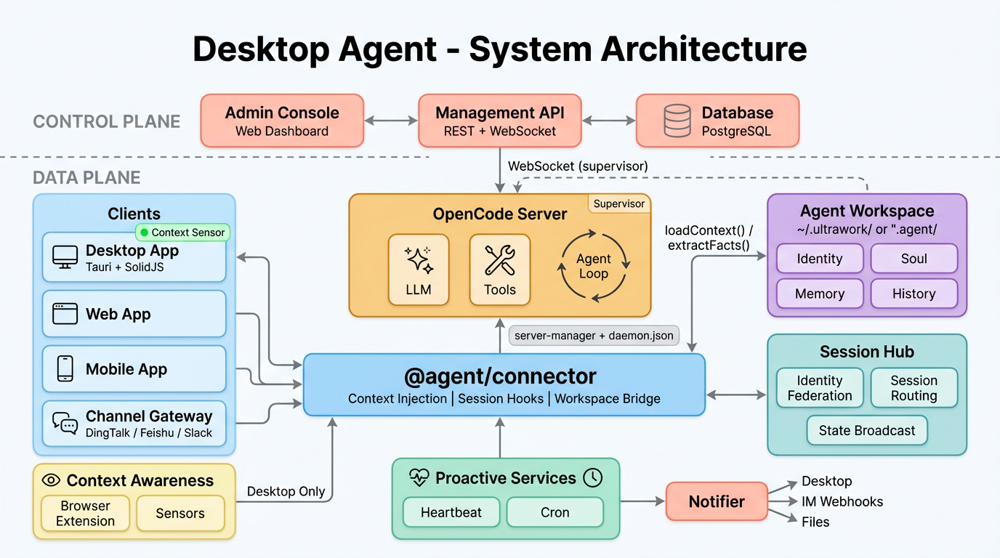
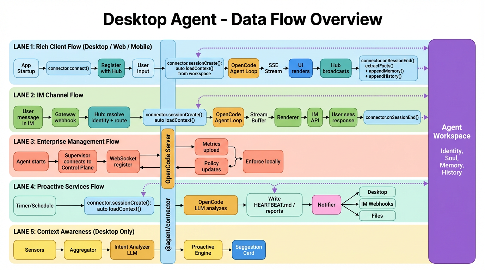

# Desktop Agent - Monorepo Architecture Design

> ⚠️ **远期愿景文档，非当前实现。** 本文描述的是完整目标架构（多端 Web/Mobile、企业管理、Control Plane、跨端协同等），**绝大部分尚未实现**。
> **当前实际架构以 [`architecture-phase1.md`](./architecture-phase1.md) 为准**（含已实现模块的状态表与数据流）。读取本文时不要将其内容当作现状。
> 未纳入开发索引；最后更新 2026-03-10。

## Overview

A desktop-grade AI agent built on top of OpenCode's server capabilities, supporting:

- **Multi-platform Clients**: Web, Desktop (Tauri), Mobile (Capacitor/Tauri Mobile)
- **IM Channel Integrations**: DingTalk, Feishu, Slack, etc.
- **Enterprise Management**: Centralized monitoring, token usage tracking, and remote policy control
- **Proactive Context Awareness**: Environment sensing and intelligent intervention (Desktop only)
- **Proactive Services**: Independent background services -- heartbeat monitoring and scheduled LLM-powered job execution with bidirectional communication via clients and IM channels
- **Cross-Surface Coordination**: Session continuity, identity federation, and state synchronization when users interact from multiple surfaces (Desktop, Web, IM channels)

Core strategy: use OpenCode as a **headless server** (compiled binary, spawned as sidecar), and build all user-facing clients and management tools independently.

## System Architecture



The system is divided into two planes:

- **Control Plane**: Centralized enterprise management (monitoring, policies, auditing)
- **Data Plane**: Individual agent instances (OpenCode Server + clients + context awareness)

```
+=========================================================================+
|                         CONTROL PLANE                                   |
|  +------------------+  +-------------------+  +--------------------+    |
|  |  Admin Console   |  |  Management API   |  |  Central Database  |    |
|  |  (Web Dashboard) |  |  (REST + WS)      |  |  (PostgreSQL)      |    |
|  +--------+---------+  +---------+---------+  +----------+---------+    |
|           |                      |                       |              |
|           +----------------------+-----------------------+              |
|                                  |                                      |
|                       +----------+----------+                           |
|                       |   Agent Registry    |                           |
|                       |   Policy Engine     |                           |
|                       |   Metrics Collector |                           |
|                       +----------+----------+                           |
+==========================|==================|===========================+
                           |                  |
              WebSocket    |                  |   WebSocket
            (supervisor)   |                  |   (supervisor)
                           |                  |
+==========================|====+   +=========|===============================+
|        DATA PLANE (Instance A)|   |         DATA PLANE (Instance B)         |
|                               |   |                                         |
|  +---------------------------+|   |  +-----------------------------------+  |
|  |     agent-supervisor      ||   |  |        agent-supervisor           |  |
|  |  - Heartbeat / Metrics    ||   |  |     - Heartbeat / Metrics         |  |
|  |  - Policy Enforcement     ||   |  |     - Policy Enforcement          |  |
|  +-------------+-------------+|   |  +----------------+------------------+  |
|                |              |   |                   |                     |
|  +-------------+-------------+|   |  +----------------+------------------+  |
|  |     OpenCode Server       ||   |  |         OpenCode Server           |  |
|  |  REST API + SSE Events    ||   |  |      REST API + SSE Events        |  |
|  +--+--------+--------+------+|   |  +---+--------+--------+--------+----+  |
|     |        |        |       |   |      |        |        |        |       |
|  +--+--+ +---+--+ +---+---+   |   |  +---+--+ +---+--+ +---+---+ +--+----+  |
|  | Web | |Desk  | |Mobile |   |   |  | Web  | |Desk  | |Mobile | |Channel|  |
|  |     | |top   | |       |   |   |  |      | |top   | |       | |Gateway|  |
|  +-----+ +--+---+ +-------+   |   |  +------+ +--+---+ +-------+ +-------+  |
|             |                 |   |              |                          |
|  +----------+------------+    |   |  +-----------+-----------+              |
|  |    context-sensor     |    |   |  |     context-sensor    |              |
|  | (Desktop only)        |    |   |  |   (Desktop only)      |              |
|  +----------+------------+    |   |  +-----------+-----------+              |
|             |                 |   |              |                          |
|  +----------+------------+    |   |  +-----------+-----------+              |
|  |  browser-extension    |    |   |  |   browser-extension   |              |
|  +----------+------------+    |   |  +-----------+-----------+              |
+===============================+   +=========================================+
```

## Integration Strategy

OpenCode is included as a **Git submodule** in `vendor/opencode`, tracking the `dev` branch.

- Each build compiles OpenCode into a standalone binary
- The binary is spawned as a sidecar process by Desktop (Tauri) or server-manager
- Rich clients connect directly via REST + SSE
- IM channels connect through the Channel Gateway
- All instances report to the Control Plane via agent-supervisor
- Desktop app includes context-sensor for proactive assistance

## Directory Structure

The monorepo uses a **two-level directory structure** to clearly separate architectural layers while keeping paths manageable.

### Module Overview

| Layer | Package | Functional Positioning |
|-------|---------|----------------------|
| **Core** | `@agent/api-client` | OpenCode Server SDK - Type-safe REST API calls and SSE event streaming. Foundation for all OpenCode communication. |
| | `@agent/server-manager` | Process Lifecycle Manager - Spawns OpenCode sidecar, monitors health, handles crash recovery with auto-restart. Local mode only. |
| | `@agent/connector` | Connection Abstraction - Unified interface for local/remote OpenCode connections. Handles mode selection, health checking, reconnection. |
| | `@agent/supervisor` | Enterprise Agent - Connects to Control Plane for heartbeat reporting, metrics collection, and remote policy enforcement. |
| | `@agent/ui` | UI Component Library - Shared SolidJS components (chat, diff, markdown, dialogs) ensuring consistent UX across platforms. |
| | `@agent/workspace` | Runtime Workspace Manager - Manages .agent/ directory and .opencode/ config scaffolding. Handles IDENTITY.md, SOUL.md, MEMORY.md, HISTORY.md read/write and session context injection. Phase 1: project-bound; Phase 2: explicit CRUD with central registry. |
| | `@agent/notifier` | Notification Dispatcher - Unified outbound notification to multiple targets: IM channels (DingTalk/Feishu/Slack webhooks), desktop (Tauri), client push (WebSocket/SSE), and file output. |
| | `@agent/hub` | Session Coordination Hub - Central registry for cross-surface session coordination. Handles identity federation (mapping IM/client user IDs to unified identity), session routing (resume conversations across surfaces), state broadcast (real-time sync to connected surfaces), conflict resolution (sequential prompt queuing per session), and notification deduplication (prevent duplicate alerts when user is active on multiple surfaces). |
| **Control** | `@agent/control-api` | Management API Service - Centralized backend for agent registry, usage metrics, policy engine, and audit logging. |
| | `@agent/control-console` | Admin Dashboard - Web UI for IT administrators to monitor agents, view analytics, and manage policies. |
| **Client** | `@agent/client-web` | Web Application - Lightweight browser client connecting to remote OpenCode Server. Quick access without installation. |
| | `@agent/client-desktop` | Desktop Application - Full-featured Tauri app with local sidecar, context awareness, offline support, and native OS integration. |
| | `@agent/client-mobile` | Mobile Application - iOS/Android app optimized for on-the-go interactions. Connects to remote server. |
| **Channel** | `@agent/channel-gateway` | IM Gateway Service - Bridges IM platforms (DingTalk, Feishu, Slack) to OpenCode via webhook adaptation. |
| **Context** | `@agent/context-sensor` | Environment Sensing Module - Captures user context from multiple sources, analyzes intent, triggers proactive suggestions. Desktop only. |
| | `@agent/context-extension` | Browser Extension - Chrome/Firefox extension for capturing web browsing context via Native Messaging API. |
| **Proactive** | `@agent/proactive-heartbeat` | Heartbeat Service - Independent background service. Periodically reads task/session state, uses LLM to summarize progress, updates HEARTBEAT.md, notifies users via clients/channels. |
| | `@agent/proactive-cron` | Cron Service - Independent background service with HTTP API. Receives job definitions from clients (direct) or channels (via OpenCode tools), executes scheduled LLM tasks, delivers results via notifier. |

### Package Naming Convention

| Layer | Directory | Package Name Pattern | Example |
|-------|-----------|---------------------|---------|
| Core (shared) | `packages/core/*` | `@agent/<name>` | `@agent/api-client` |
| Control Plane | `packages/control/*` | `@agent/control-<name>` | `@agent/control-api` |
| Client Apps | `packages/client/*` | `@agent/client-<name>` | `@agent/client-desktop` |
| Channels | `packages/channel/*` | `@agent/channel-<name>` | `@agent/channel-gateway` |
| Context | `packages/context/*` | `@agent/context-<name>` | `@agent/context-sensor` |
| Proactive | `packages/proactive/*` | `@agent/proactive-<name>` | `@agent/proactive-heartbeat` |

### Full Directory Tree

```
your-agent/
├── package.json                  # Workspace root (Bun workspaces)
├── turbo.json                    # Turborepo pipeline config
├── bun.lock
├── AGENTS.md                     # AI quick reference (onboarding handbook)
│
├── .ai/                          # AI collaboration tooling
│   ├── session.md                # Current session state (committed)
│   ├── handoff/                  # Historical handoff notes
│   ├── commands/                 # Shared custom AI commands
│   └── prompts/                  # Reusable prompt templates
│
├── vendor/
│   └── opencode/                 # Git submodule (tracking dev branch)
│
├── scripts/
│   ├── build-opencode.ts         # Compile vendor/opencode to binary
│   └── dev.ts                    # Local development launcher
│
├── docs/
│   ├── architecture-full.md      # This file - full system architecture
│   ├── architecture-phase1.md   # Phase 1 architecture
│   └── ai-context/               # Shared AI knowledge base
│       ├── README.md             # Index and navigation guide
│       ├── team/                 # Team-wide standards
│       │   ├── conventions.md    # Code style, naming, patterns
│       │   ├── workflow.md       # Git flow, PR process, CI/CD
│       │   └── environment.md    # Dev setup, tools, scripts
│       ├── project/              # Project-specific knowledge
│       │   ├── glossary.md       # Domain terms, abbreviations
│       │   └── decisions/        # Architecture Decision Records (ADR)
│       ├── experience/           # Accumulated wisdom
│       │   ├── pitfalls.md       # Common mistakes + solutions
│       │   └── debugging.md      # Debugging strategies
│       └── business/             # Business logic
│           ├── rules.md          # Core business rules
│           └── edge-cases.md     # Special cases
│
├── packages/
│   │
│   │  =============================================
│   │  core/ - Shared Foundation (most frequently used)
│   │  =============================================
│   │
│   ├── core/
│   │   │
│   │   ├── api-client/           # @agent/api-client
│   │   │   │
│   │   │   │  [Functional Positioning]
│   │   │   │  TypeScript SDK for OpenCode Server REST API.
│   │   │   │  Provides type-safe API calls and SSE event streaming.
│   │   │   │  Foundation dependency for all modules communicating
│   │   │   │  with OpenCode. Independently publishable to npm.
│   │   │   │
│   │   │   ├── src/
│   │   │   │   ├── client.ts     #   REST call wrappers (session, message, permission)
│   │   │   │   ├── events.ts     #   SSE event subscription, parsing, reconnection
│   │   │   │   └── types.ts      #   Types auto-generated from OpenAPI spec
│   │   │   └── package.json
│   │   │
│   │   ├── server-manager/       # @agent/server-manager
│   │   │   │
│   │   │   │  [Functional Positioning]
│   │   │   │  OpenCode Server process lifecycle manager (LOCAL MODE ONLY).
│   │   │   │  Responsible for spawning sidecar binary, health monitoring,
│   │   │   │  crash recovery with auto-restart, and supervisor initialization.
│   │   │   │  Used internally by @agent/connector for local connections.
│   │   │   │  Not used directly by client apps - use connector instead.
│   │   │   │
│   │   │   ├── src/
│   │   │   │   ├── spawn.ts      #   Start binary as child process / connect to existing
│   │   │   │   ├── health.ts     #   Periodic health check, crash detection, auto restart
│   │   │   │   ├── config.ts     #   Runtime config: port, password, working directory
│   │   │   │   └── supervisor.ts #   Initialize agent-supervisor on server startup
│   │   │   └── package.json
│   │   │
│   │   ├── connector/            # @agent/connector
│   │   │   │
│   │   │   │  [Functional Positioning]
│   │   │   │  Unified connection abstraction for OpenCode Server.
│   │   │   │  Supports both local (sidecar) and remote (network) modes:
│   │   │   │  - Local: Uses server-manager to spawn/manage binary
│   │   │   │  - Remote: Direct connection to existing server
│   │   │   │  Provides consistent interface for all clients regardless of mode.
│   │   │   │  Handles health checking, reconnection, and mode switching.
│   │   │   │  Default mode: local for Desktop, remote for Web/Mobile.
│   │   │   │  Integrates @agent/workspace for transparent context injection
│   │   │   │  and post-session fact extraction across all consumers.
│   │   │   │
│   │   │   ├── src/
│   │   │   │   ├── connector.ts  #   Main entry: createConnector(), mode detection
│   │   │   │   ├── local.ts      #   LocalConnection: wraps server-manager + api-client
│   │   │   │   ├── remote.ts     #   RemoteConnection: api-client with auth
│   │   │   │   ├── health.ts     #   Unified health checking for both modes
│   │   │   │   ├── reconnect.ts  #   Reconnection strategy with exponential backoff
│   │   │   │   ├── auth.ts       #   Remote authentication (API key, JWT)
│   │   │   │   ├── context.ts    #   Workspace context injection on session create
│   │   │   │   ├── hooks.ts      #   Session lifecycle hooks: onSessionEnd -> extractFacts
│   │   │   │   └── types.ts      #   ConnectionConfig, ConnectionStatus, Connection interface
│   │   │   └── package.json      #   deps: @agent/api-client, @agent/server-manager,
│   │   │                         #         @agent/workspace
│   │   │
│   │   ├── supervisor/           # @agent/supervisor
│   │   │   │
│   │   │   │  [Functional Positioning]
│   │   │   │  Enterprise management agent running alongside OpenCode.
│   │   │   │  Connects to Control Plane via WebSocket for:
│   │   │   │  - Heartbeat/status reporting (agent registry)
│   │   │   │  - Token usage metrics collection and upload
│   │   │   │  - Remote policy enforcement (tool/model/directory restrictions)
│   │   │   │  - Audit log forwarding
│   │   │   │  Works in degraded mode when Control Plane is unreachable.
│   │   │   │
│   │   │   ├── src/
│   │   │   │   ├── supervisor.ts #   Main entry: WebSocket connection, message routing
│   │   │   │   ├── heartbeat.ts  #   Periodic status reporting (state, sessions, uptime)
│   │   │   │   ├── metrics.ts    #   Intercept OpenCode events, collect token usage
│   │   │   │   ├── policy.ts     #   Receive policies from Control Plane, enforce locally
│   │   │   │   └── hooks/
│   │   │   │       └── opencode.ts #  Request interceptor for permission checks
│   │   │   └── package.json
│   │   │
│   │   └── ui/                   # @agent/ui
│   │       │
│   │       │  [Functional Positioning]
│   │       │  Shared SolidJS UI component library for all client apps.
│   │       │  Ensures consistent UX across Web/Desktop/Mobile.
│   │       │  Handles real-time SSE streaming display, code rendering,
│   │       │  and interactive dialogs. Theme-aware and responsive.
│   │       │
│   │       ├── src/
│   │       │   ├── chat/         #   Message list, input box, streaming text renderer
│   │       │   ├── diff/         #   File diff display with syntax highlighting
│   │       │   ├── permission/   #   Permission request confirmation dialog
│   │       │   ├── markdown/     #   Markdown renderer with code block support
│   │       │   └── proactive/    #   Proactive suggestion cards (Desktop only)
│   │       └── package.json
│   │
│   │   └── workspace/            # @agent/workspace
│   │       │
│   │       │  [Functional Positioning]
│   │       │  Runtime workspace manager for .agent/ directory and
│   │       │  .opencode/ config scaffolding in end-user projects.
│   │       │  Handles:
│   │       │  - .agent/ directory creation and structure
│   │       │  - .opencode/ config scaffolding from bundled defaults
│   │       │  - IDENTITY.md and SOUL.md reading for system prompt
│   │       │  - MEMORY.md read/write with fact deduplication
│   │       │  - HISTORY.md append and monthly rotation
│   │       │  - Context bundle assembly for session initialization
│   │       │  - Post-session fact extraction from messages
│   │       │
│   │       ├── src/
│   │       │   ├── workspace.ts  #   Main entry: init .agent/, detect project root
│   │       │   ├── scaffold.ts   #   Scaffold .opencode/ from bundled defaults
│   │       │   ├── identity.ts   #   Read IDENTITY.md, construct identity context
│   │       │   ├── soul.ts       #   Read SOUL.md, construct personality prompt
│   │       │   ├── memory.ts     #   Read/write MEMORY.md, dedup logic
│   │       │   ├── history.ts    #   Append HISTORY.md, monthly rotation
│   │       │   ├── context.ts    #   Assemble context bundle from all workspace files
│   │       │   ├── extractor.ts  #   Extract facts from session messages (post-session)
│   │       │   └── config.ts     #   Workspace config: paths, rotation, git behavior
│   │       ├── defaults/
│   │       │   └── opencode.json #   Bundled default OpenCode config template
│   │       └── package.json      #   deps: @agent/api-client
│   │
│   │   └── notifier/             # @agent/notifier
│   │       │
│   │       │  [Functional Positioning]
│   │       │  Unified outbound notification dispatcher.
│   │       │  Routes notification payloads to configured targets:
│   │       │  - IM channels (DingTalk/Feishu/Slack incoming webhooks)
│   │       │  - Desktop system notifications (Tauri API)
│   │       │  - Client push (WebSocket/SSE to connected clients)
│   │       │  - File output (write to specified path)
│   │       │  Lightweight formatting per target. Does not depend
│   │       │  on Channel Gateway -- uses IM webhook APIs directly.
│   │       │
│   │       ├── src/
│   │       │   ├── notifier.ts   #   Main entry: dispatch to configured targets
│   │       │   ├── types.ts      #   NotificationPayload, NotifyTarget, NotifyConfig
│   │       │   ├── targets/
│   │       │   │   ├── file.ts   #   Write notification to file
│   │       │   │   ├── session.ts #  Create/append to OpenCode session
│   │       │   │   ├── desktop.ts #  Tauri notification API / system notification
│   │       │   │   ├── dingtalk.ts # DingTalk incoming webhook (HTTP POST)
│   │       │   │   ├── feishu.ts #   Feishu incoming webhook (HTTP POST)
│   │       │   │   └── slack.ts  #   Slack incoming webhook (HTTP POST)
│   │       │   └── formatter.ts  #   Format payload per target (markdown variants)
│   │       └── package.json      #   deps: none (standalone, uses fetch for webhooks)
│   │
│   │   └── hub/                   # @agent/hub
│   │       │
│   │       │  [Functional Positioning]
│   │       │  Central session coordination hub for cross-surface
│   │       │  user experience unification. When a user interacts
│   │       │  via Desktop, Web, DingTalk, Feishu, or Slack,
│   │       │  this hub ensures session continuity and state
│   │       │  consistency across all surfaces. Responsibilities:
│   │       │  - Identity federation: map IM/client user IDs to
│   │       │    a unified user identity
│   │       │  - Session routing: find/resume existing session
│   │       │    when user switches surface
│   │       │  - State broadcast: push real-time session events
│   │       │    to all connected surfaces for the same user
│   │       │  - Conflict resolution: serialize concurrent prompts
│   │       │    to same session via queue
│   │       │  - Notification dedup: suppress duplicate alerts
│   │       │    when user is active on a surface
│   │       │
│   │       ├── src/
│   │       │   ├── hub.ts        #   Main entry: createHub(), event loop, surface registry
│   │       │   ├── identity.ts   #   Identity federation: alias mapping, lookup, CRUD
│   │       │   ├── router.ts     #   Session routing: find session by user+project, resume logic
│   │       │   ├── broadcast.ts  #   State broadcast: SSE/WS fan-out to connected surfaces
│   │       │   ├── queue.ts      #   Conflict resolution: per-session prompt queue, FIFO execution
│   │       │   ├── presence.ts   #   Surface presence tracking: which surfaces are active per user
│   │       │   ├── dedup.ts      #   Notification dedup: suppress if user active on surface
│   │       │   ├── store.ts      #   Persistence: identity map, session index (SQLite or JSON file)
│   │       │   └── types.ts      #   UnifiedUser, SurfaceConnection, SessionRoute, HubConfig
│   │       └── package.json      #   deps: @agent/api-client
│   │
│   │  =============================================
│   │  control/ - Enterprise Management (Control Plane)
│   │  =============================================
│   │
│   ├── control/
│   │   │
│   │   ├── api/                  # @agent/control-api
│   │   │   │
│   │   │   │  [Functional Positioning]
│   │   │   │  Centralized enterprise management API service.
│   │   │   │  Single source of truth for agent registry, policies,
│   │   │   │  usage metrics, and audit logs. Provides:
│   │   │   │  - REST API for admin console
│   │   │   │  - WebSocket endpoint for agent supervisors
│   │   │   │  - Prometheus metrics endpoint for monitoring
│   │   │   │  Deployed as standalone service with PostgreSQL backend.
│   │   │   │
│   │   │   ├── src/
│   │   │   │   ├── server.ts     #   Main HTTP/WS server (Hono on Bun)
│   │   │   │   ├── registry/
│   │   │   │   │   ├── agent.ts  #   Agent registration, heartbeat processing, status tracking
│   │   │   │   │   └── discovery.ts # Query online agents, filter by status/user/project
│   │   │   │   ├── metrics/
│   │   │   │   │   ├── collector.ts #  Receive metrics from agents via WebSocket
│   │   │   │   │   ├── aggregator.ts # Aggregate token usage by agent/user/time period
│   │   │   │   │   └── storage.ts #  Persist metrics to PostgreSQL, time-series optimization
│   │   │   │   ├── policy/
│   │   │   │   │   ├── engine.ts #   Evaluate policies against agent requests
│   │   │   │   │   ├── rules.ts  #   Policy rule definitions (JSON Schema based)
│   │   │   │   │   └── sync.ts   #   Push policy updates to connected agents
│   │   │   │   ├── audit/
│   │   │   │   │   ├── logger.ts #   Receive and store audit events from agents
│   │   │   │   │   └── query.ts  #   Audit log query API with filtering/pagination
│   │   │   │   └── db/
│   │   │   │       ├── schema.ts #   Drizzle ORM schema (agents, token_usage, policies, audit_logs)
│   │   │   │       └── migrations/
│   │   │   └── package.json
│   │   │
│   │   └── console/              # @agent/control-console
│   │       │
│   │       │  [Functional Positioning]
│   │       │  Web-based admin dashboard for enterprise management.
│   │       │  Provides visual interface for IT administrators to:
│   │       │  - Monitor all agent instances in real-time
│   │       │  - View token usage analytics and cost reports
│   │       │  - Configure and deploy security policies
│   │       │  - Browse and search audit logs
│   │       │  Connects to @agent/control-api via REST.
│   │       │
│   │       ├── src/
│   │       │   ├── App.tsx
│   │       │   ├── pages/
│   │       │   │   ├── dashboard/  # Overview: active agents, usage summary, alerts
│   │       │   │   ├── agents/     # Agent list, detail view, real-time status
│   │       │   │   ├── usage/      # Token consumption charts, cost breakdown, export
│   │       │   │   ├── policies/   # Policy CRUD, assignment to agents/groups
│   │       │   │   └── audit/      # Audit log viewer with search and filters
│   │       │   └── components/
│   │       └── package.json
│   │
│   │  =============================================
│   │  client/ - User-Facing Applications (Data Plane)
│   │  =============================================
│   │
│   ├── client/
│   │   │
│   │   ├── web/                  # @agent/client-web
│   │   │   │
│   │   │   │  [Functional Positioning]
│   │   │   │  Browser-based web application for AI agent interaction.
│   │   │   │  Lightweight client connecting to remote OpenCode Server.
│   │   │   │  Ideal for quick access without installation.
│   │   │   │  Features: chat UI, session management, file diff viewing.
│   │   │   │  No local server management or context awareness.
│   │   │   │
│   │   │   ├── src/
│   │   │   │   ├── App.tsx       #   Application root, routing setup
│   │   │   │   ├── pages/        #   Chat, settings, session history pages
│   │   │   │   └── context/      #   React contexts: ServerProvider, AuthProvider
│   │   │   ├── index.html
│   │   │   └── package.json      #   deps: @agent/api-client, @agent/ui
│   │   │
│   │   ├── desktop/              # @agent/client-desktop
│   │   │   │
│   │   │   │  [Functional Positioning]
│   │   │   │  Full-featured desktop application built with Tauri.
│   │   │   │  The primary and most capable client platform:
│   │   │   │  - Spawns OpenCode Server as sidecar process
│   │   │   │  - Full context awareness (all sensors available)
│   │   │   │  - Native OS integration (clipboard, window, filesystem)
│   │   │   │  - Offline mode with local LLM support
│   │   │   │  - Secure credential storage via OS keychain
│   │   │   │  Recommended for power users and enterprise deployment.
│   │   │   │
│   │   │   ├── src/              #   SolidJS frontend (same components as web)
│   │   │   ├── src-tauri/        #   Rust backend for native capabilities
│   │   │   │   └── src/
│   │   │   │       ├── lib.rs    #     Tauri commands, sidecar spawn, IPC bridge
│   │   │   │       ├── server.rs #     OpenCode health check, connection management
│   │   │   │       └── sensors/  #     Native sensor implementations (Rust)
│   │   │   │           ├── mod.rs      # Sensor module exports
│   │   │   │           ├── clipboard.rs # System clipboard monitoring
│   │   │   │           ├── window.rs    # Active window title/app detection
│   │   │   │           └── security.rs  # OS security event monitoring
│   │   │   └── package.json      #   deps: @agent/api-client, @agent/ui,
│   │   │                         #         @agent/server-manager, @agent/context-sensor
│   │   │
│   │   └── mobile/               # @agent/client-mobile
│   │       │
│   │       │  [Functional Positioning]
│   │       │  Mobile application for iOS and Android.
│   │       │  Built with Capacitor or Tauri Mobile.
│   │       │  Connects to remote OpenCode Server (no local sidecar).
│   │       │  Limited context awareness due to mobile OS sandbox.
│   │       │  Features: chat UI, push notifications, session sync.
│   │       │  Optimized for on-the-go quick interactions.
│   │       │
│   │       ├── src/              #   SolidJS frontend (responsive mobile layout)
│   │       ├── ios/              #   iOS native project (Xcode)
│   │       ├── android/          #   Android native project (Gradle)
│   │       └── package.json      #   deps: @agent/api-client, @agent/ui
│   │
│   │  =============================================
│   │  channel/ - External Integrations
│   │  =============================================
│   │
│   ├── channel/
│   │   │
│   │   └── gateway/              # @agent/channel-gateway
│   │       │
│   │       │  [Functional Positioning]
│   │       │  IM platform integration gateway service.
│   │       │  Bridges between IM platforms (DingTalk, Feishu, Slack)
│   │       │  and OpenCode Server. Handles:
│   │       │  - Webhook reception from IM platforms
│   │       │  - User-to-session mapping and lifecycle
│   │       │  - SSE stream buffering for non-streaming IM APIs
│   │       │  - Message format adaptation (markdown downgrade, cards)
│   │       │  Registers IM users with @agent/hub for cross-surface
│   │       │  session coordination and identity federation.
│   │       │  Deployed as standalone service, one instance per IM bot.
│   │       │
│   │       ├── src/
│   │       │   ├── gateway.ts    #   HTTP server: webhook endpoints, health check
│   │       │   ├── session-pool.ts # Map IM user -> OpenCode session, lifecycle management
│   │       │   ├── stream-buffer.ts # Collect SSE stream, emit complete messages
│   │       │   ├── adapters/
│   │       │   │   ├── types.ts  #   IM adapter interface definition
│   │       │   │   ├── dingtalk.ts # DingTalk Bot: webhook, outgoing message, cards
│   │       │   │   ├── feishu.ts #   Feishu Bot: webhook, outgoing message, cards
│   │       │   │   └── slack.ts  #   Slack Bot: webhook, outgoing message, blocks
│   │       │   └── renderers/
│   │       │       ├── card.ts   #   Interactive card templates (permission, confirm)
│   │       │       └── markdown.ts # Markdown -> platform-specific format conversion
│   │       └── package.json      #   deps: @agent/api-client
│   │
│   │  =============================================
│   │  context/ - Environment Awareness (Desktop Only)
│   │  =============================================
│   │
│   └── context/
│       │
│       ├── sensor/               # @agent/context-sensor
│       │   │
│       │   │  [Functional Positioning]
│       │   │  Desktop environment sensing and proactive assistance module.
│       │   │  Captures user context from multiple sources, analyzes intent,
│       │   │  and triggers proactive suggestions. Core capabilities:
│       │   │  - Multi-source sensor data collection
│       │   │  - Privacy-preserving aggregation and filtering
│       │   │  - LLM-powered intent analysis
│       │   │  - Smart intervention timing (cooldown, frequency control)
│       │   │  Desktop-only feature requiring native OS access.
│       │   │
│       │   ├── src/
│       │   │   ├── index.ts      #   Module entry: sensor orchestration, event bus
│       │   │   ├── sensors/
│       │   │   │   ├── types.ts  #   SensorEvent interface, SensorData union types
│       │   │   │   ├── browser.ts #   Browser sensor: URL, title, selection (via extension)
│       │   │   │   ├── clipboard.ts # Clipboard sensor: text change detection
│       │   │   │   ├── window.ts #   Window sensor: active app, window title
│       │   │   │   ├── filesystem.ts # File sensor: project file change watching
│       │   │   │   ├── security.ts # Security sensor: OS security alerts
│       │   │   │   └── ide.ts    #   IDE sensor: current file, errors (via LSP)
│       │   │   ├── aggregator/
│       │   │   │   ├── filter.ts #   Privacy filter: remove sensitive data, anonymize URLs
│       │   │   │   ├── dedup.ts  #   Deduplication: ignore repeated events within window
│       │   │   │   └── batch.ts  #   Batching: group events for efficient processing
│       │   │   ├── analyzer/
│       │   │   │   ├── intent.ts #   LLM-based intent detection from aggregated context
│       │   │   │   ├── patterns.ts # Rule-based pattern matching (fast path)
│       │   │   │   └── context.ts #   Build context object for agent prompts
│       │   │   ├── engine/
│       │   │   │   ├── proactive.ts # Decision engine: when/how to show suggestions
│       │   │   │   ├── cooldown.ts # Cooldown manager: prevent suggestion fatigue
│       │   │   │   └── preferences.ts # User preference learning from accept/dismiss
│       │   │   └── config.ts     #   Sensor configuration: enable/disable, thresholds
│       │   └── package.json
│       │
│       └── extension/            # @agent/context-extension
│           │
│           │  [Functional Positioning]
│           │  Browser extension for capturing web browsing context.
│           │  Runs in Chrome/Firefox, communicates with Desktop app
│           │  via Native Messaging API. Captures:
│           │  - Current page URL and title
│           │  - Selected text
│           │  - Form field context (anonymized)
│           │  User must explicitly install and grant permissions.
│           │  All data processed locally, never uploaded to cloud.
│           │
│           ├── src/
│           │   ├── background.ts #   Service Worker: native messaging, event routing
│           │   ├── content.ts    #   Content Script: DOM access, selection capture
│           │   └── messaging.ts  #   Native Messaging protocol with Desktop app
│           ├── manifest.json     #   WebExtension manifest (Chrome MV3 / Firefox)
│           └── package.json
│
│   │  =============================================
│   │  proactive/ - Autonomous Background Services
│   │  =============================================
│   │
│   └── proactive/
│       │
│       ├── heartbeat/            # @agent/proactive-heartbeat
│       │   │
│       │   │  [Functional Positioning]
│       │   │  Independent background service that periodically
│       │   │  examines task/session state, interacts with OpenCode
│       │   │  using LLM to summarize progress and analyze status,
│       │   │  writes structured output to HEARTBEAT.md, and
│       │   │  notifies users via clients/channels when notable
│       │   │  events occur (status changes, blockers, completions).
│       │   │  Default interval: 30 minutes. Configurable by user.
│       │   │
│       │   ├── src/
│       │   │   ├── heartbeat.ts  #   Main entry: timer loop, session inspection
│       │   │   ├── collector.ts  #   Gather session state, messages, tool usage from OpenCode
│       │   │   ├── analyzer.ts   #   LLM-powered summarization and status analysis
│       │   │   ├── writer.ts     #   HEARTBEAT.md file writer (atomic write, git-friendly)
│       │   │   └── config.ts     #   Interval, output path, notification targets, LLM model
│       │   └── package.json      #   deps: @agent/connector, @agent/notifier, @agent/workspace
│       │
│       └── cron/                 # @agent/proactive-cron
│           │
│           │  [Functional Positioning]
│           │  Independent background service with HTTP API.
│           │  Receives job definitions from:
│           │  - Client UI (direct REST API calls)
│           │  - Channels via OpenCode (LLM interprets user intent,
│           │    calls cron MCP tools to create/manage jobs)
│           │  Executes LLM-powered tasks on schedule:
│           │  - Fixed time, interval, or cron expressions
│           │  - Each task uses connector -> OpenCode -> LLM
│           │  Delivers results via @agent/notifier to configured
│           │  targets (files, client push, IM channels).
│           │
│           ├── src/
│           │   ├── server.ts     #   HTTP API server: CRUD endpoints for jobs
│           │   ├── scheduler.ts  #   Cron engine, job registry, execution loop
│           │   ├── parser.ts     #   Parse cron expressions, intervals, fixed times
│           │   ├── executor.ts   #   Execute job: create session, send prompt, collect result
│           │   ├── jobs.ts       #   Job definition types, built-in job templates
│           │   ├── mcp.ts        #   MCP tool definitions for OpenCode (cron CRUD via LLM)
│           │   ├── store.ts      #   Persist job definitions and execution history
│           │   └── config.ts     #   Max concurrent jobs, retry policy, notification targets
│           └── package.json      #   deps: @agent/connector, @agent/notifier
```

## Package Dependency Graph

```
                              CONTROL PLANE
                    +-----------------------------+
                    |   @agent/control-api        |
                    +-------------+---------------+
                                  |
                    +-------------+---------------+
                    |                             |
           +--------+----------+       +----------+---------+
           |@agent/control-    |       |   @agent/supervisor |
           |console            |       +---------+----------+
           +-------------------+                 |
                                                 |
- - - - - - - - - - - - - - - - - - - - - - - - -+- - - - - - - - - - - -
                                                 |
                              DATA PLANE         |
                                                 |
                    +-------------------+        |
                    | @agent/api-client | <------+  (uses for OpenCode API)
                    +---------+---------+
                              |
              +---------------+-----+---------+
              |                     |         |
    +---------+---------+  +--------+---+  +--+---------------+
    |@agent/server-     |  | @agent/ui  |  |@agent/workspace  |
    |manager            |  +-----+------+  |(runtime context) |
    +---------+---------+        |         +--------+---------+
              |                  |                  |
              +------+-----------+                  |
                     |                              |
           +---------+---------+                    |
           |@agent/connector   |<-------------------+
           |(+ context.ts,     |  workspace context injection
           | hooks.ts)         |  session lifecycle hooks
           +--------+----------+
                    |
         +----------+----------+---------+
         |          |          |         |
  +------+--+  +---+---+  +--+------+  ++-----------+
  |@agent/  |  |@agent/|  |@agent/  |  |@agent/     |
  |hub      |  |notfir |  |channel- |  |client-     |
  +-+-------+  +--+----+  |gateway  |  |desktop/    |
    |             |        +---+-----+  |web/mobile  |
    |             |            |        +---+--------+
    |             |            |            |
    |    +--------+------+     |  +---------+---------+
    |    |               |     |  |@agent/context-    |
    |    |               |     |  |sensor + extension |
    |    |               |     |  |(desktop only)     |
    |    |               |     |  +-------------------+
    |    |               |     |
    +----+---+-----------+-----+
         |   |
  +------+---+-------+  +------+----------+
  |@agent/proactive-  |  |@agent/proactive-|
  |heartbeat          |  |cron             |
  |(+ watchdog)       |  |(+ HTTP API)     |
  +-------------------+  +-----------------+

Note: @agent/connector depends on @agent/workspace and handles
context injection + session lifecycle hooks for ALL consumers.
Heartbeat and Cron use @agent/connector (not api-client directly)
for automatic workspace context injection.

- - - - - - - - - - - - - - - - - - - - - - - - - - - - - - - - - - - -

                    PROACTIVE SERVICES
                    (Independent background services with bidirectional communication)

                                 INBOUND                    OUTBOUND
                              (commands)                 (notifications)

  Clients (UI) ──(REST)───┐                    ┌───> Clients (push)
                           │                    │
  Channels ──> Channel ──> OpenCode             ├───> Channels (IM webhooks)
  (DingTalk,   Gateway     (LLM interprets,     │
   Feishu,                  calls MCP tools)     ├───> Desktop (Tauri notification)
   Slack)        │              │                │
                 │              │ (MCP tool call) ├───> Files (HEARTBEAT.md, reports/)
                 │              v                │
                 │    +---------+---------+      │
                 │    |@agent/proactive-  |      │     +-------------------+
                 │    |cron (HTTP API)    |──────+────>|  @agent/notifier  |
                 │    +---------+---------+      │     +-------------------+
                 │              |                 │
                 │    +---------+---------+      │
                 │    |@agent/proactive-  |──────┘
                 │    |heartbeat          |
                 │    +---------+---------+
                 │              |
                 │    +---------+---------+
                 └───>|@agent/connector   |  (all services use connector for OpenCode
                      |(workspace context)|   + automatic workspace context injection)
                      +-------------------+
```

### Connection Mode by Client

| Client | Default Mode | Supported Modes | Notes |
|--------|-------------|-----------------|-------|
| Desktop | `local` | local, remote | Can switch to remote for enterprise shared server |
| Web | `remote` | remote only | No local process spawning in browser |
| Mobile | `remote` | remote only | No local process spawning on mobile |
| Channel Gateway | `remote` | local, remote | Usually connects to shared server |

### Package Dependencies Table

| Package | Path | Functional Summary | Internal Dependencies |
|---------|------|-------------------|----------------------|
| `@agent/api-client` | `core/api-client` | OpenCode REST/SSE SDK, type-safe API calls | none |
| `@agent/server-manager` | `core/server-manager` | Sidecar lifecycle: spawn, health check, auto-restart (local only) | `@agent/api-client`, `@agent/supervisor` |
| `@agent/connector` | `core/connector` | Unified local/remote connection abstraction + workspace context injection + session lifecycle hooks | `@agent/api-client`, `@agent/server-manager`, `@agent/workspace` |
| `@agent/supervisor` | `core/supervisor` | Enterprise agent: heartbeat, metrics, policy enforcement | `@agent/api-client` |
| `@agent/ui` | `core/ui` | SolidJS component library: chat, diff, markdown, dialogs | `@agent/api-client` |
| `@agent/workspace` | `core/workspace` | Runtime .agent/ manager + .opencode/ scaffolding: IDENTITY, SOUL, MEMORY, HISTORY, context assembly | none |
| `@agent/control-api` | `control/api` | Central management API: registry, metrics, policies, audit | none (standalone) |
| `@agent/control-console` | `control/console` | Admin dashboard: monitoring, analytics, policy management | none (REST to control-api) |
| `@agent/client-web` | `client/web` | Browser app: lightweight, remote server connection | `@agent/connector`, `@agent/ui`, `@agent/hub` |
| `@agent/client-desktop` | `client/desktop` | Tauri app: full-featured, local/remote, context awareness | `@agent/connector`, `@agent/ui`, `@agent/context-sensor`, `@agent/workspace`, `@agent/hub` |
| `@agent/client-mobile` | `client/mobile` | iOS/Android app: mobile-optimized, remote server | `@agent/connector`, `@agent/ui`, `@agent/hub` |
| `@agent/channel-gateway` | `channel/gateway` | IM integration: DingTalk/Feishu/Slack webhook adapter | `@agent/connector`, `@agent/hub` |
| `@agent/context-sensor` | `context/sensor` | Environment sensing: multi-source capture, intent analysis | `@agent/api-client` |
| `@agent/context-extension` | `context/extension` | Browser extension: page context capture via native messaging | none (standalone) |
| `@agent/notifier` | `core/notifier` | Outbound notification dispatcher: IM webhooks, desktop, client push, file | none (standalone, uses fetch) |
| `@agent/hub` | `core/hub` | Session coordination hub: identity federation, session routing, state broadcast, conflict resolution, notification dedup | `@agent/api-client` |
| `@agent/proactive-heartbeat` | `proactive/heartbeat` | Independent background service: periodic LLM-powered progress summary, server watchdog, notifications | `@agent/connector`, `@agent/notifier`, `@agent/workspace` |
| `@agent/proactive-cron` | `proactive/cron` | Independent background service with HTTP API: scheduled LLM tasks, MCP tools, notifications | `@agent/connector`, `@agent/notifier` |

### Workspace Configuration

```jsonc
// package.json (root)
{
  "name": "agent-monorepo",
  "private": true,
  "workspaces": [
    "packages/core/*",
    "packages/control/*",
    "packages/client/*",
    "packages/channel/*",
    "packages/context/*",
    "packages/proactive/*"
  ]
}
```

## Data Flow



### Connection Establishment (via @agent/connector)

```
┌─────────────────────────────────────────────────────────────────────────┐
│                        Connection Flow                                   │
├─────────────────────────────────────────────────────────────────────────┤
│                                                                          │
│  LOCAL MODE (Desktop default)                                           │
│  ─────────────────────────────                                          │
│                                                                          │
│  createConnector({ mode: "local" })                                     │
│       │                                                                  │
│       ├──► server-manager.spawn()     → Start OpenCode binary           │
│       │         │                                                        │
│       │         ├──► health.waitReady()  → Wait for server ready        │
│       │         │                                                        │
│       │         └──► supervisor.init()   → Initialize enterprise agent  │
│       │                                                                  │
│       └──► api-client.create(localUrl)  → Create SDK instance           │
│                 │                                                        │
│                 └──► Return Connection { client, status, ... }          │
│                                                                          │
├─────────────────────────────────────────────────────────────────────────┤
│                                                                          │
│  REMOTE MODE (Web/Mobile default)                                       │
│  ────────────────────────────────                                       │
│                                                                          │
│  createConnector({ mode: "remote", remote: { baseUrl, apiKey } })       │
│       │                                                                  │
│       ├──► auth.authenticate(apiKey)    → Validate credentials          │
│       │                                                                  │
│       ├──► health.check(baseUrl)        → Verify server reachable       │
│       │                                                                  │
│       └──► api-client.create(baseUrl)   → Create SDK instance           │
│                 │                                                        │
│                 └──► Return Connection { client, status, ... }          │
│                                                                          │
└─────────────────────────────────────────────────────────────────────────┘
```

### Connector API

```typescript
// @agent/connector/src/types.ts

interface ConnectionConfig {
  mode: "local" | "remote"
  
  // Local mode options (Desktop)
  local?: {
    binary?: string           // Path to opencode binary (default: auto-detect)
    workingDir?: string       // Project directory (default: cwd)
    port?: number             // Server port (default: auto-assign)
    autoRestart?: boolean     // Restart on crash (default: true)
  }
  
  // Remote mode options (Web/Mobile/Enterprise)
  remote?: {
    baseUrl: string           // e.g., "https://agent.company.com"
    apiKey?: string           // API key authentication
    jwt?: string              // JWT token authentication
    timeout?: number          // Connection timeout (default: 30000ms)
  }
  
  // Common options
  healthCheckInterval?: number  // Health check interval (default: 5000ms)
  reconnect?: {
    enabled: boolean          // Auto-reconnect on disconnect (default: true)
    maxRetries?: number       // Max retry attempts (default: Infinity)
    backoff?: "linear" | "exponential"  // Backoff strategy (default: exponential)
  }
}

interface Connection {
  readonly client: ApiClient           // OpenCode API client
  readonly status: ConnectionStatus    // Current connection status
  readonly mode: "local" | "remote"    // Active connection mode
  
  connect(): Promise<void>             // Establish connection
  disconnect(): Promise<void>          // Close connection
  reconnect(): Promise<void>           // Force reconnection
  
  onStatusChange(cb: (status: ConnectionStatus) => void): () => void
  onError(cb: (error: ConnectionError) => void): () => void
}

type ConnectionStatus = 
  | { state: "disconnected" }
  | { state: "connecting" }
  | { state: "connected"; serverVersion: string }
  | { state: "reconnecting"; attempt: number }
  | { state: "error"; error: ConnectionError }
```

### Connector Usage Examples

```typescript
// Desktop App - Local mode (default)
const conn = createConnector({
  mode: "local",
  local: {
    workingDir: "/path/to/project",
    autoRestart: true
  }
})
await conn.connect()

// Desktop App - Remote mode (enterprise)
const conn = createConnector({
  mode: "remote",
  remote: {
    baseUrl: process.env.AGENT_SERVER_URL,
    apiKey: await keychain.get("agent-api-key")
  }
})
await conn.connect()

// Web App - Remote mode only
const conn = createConnector({
  mode: "remote",
  remote: {
    baseUrl: "https://agent.company.com",
    jwt: authToken
  }
})
await conn.connect()

// All clients use same API after connection
const session = await conn.client.sessionCreate()
await conn.client.sessionPrompt(session.id, { ... })
```

### Rich Clients (Web / Desktop / Mobile)

```
App startup
  -> createConnector({ mode: config.mode })
    -> conn.connect()
      -> Connection established (local or remote)
  -> Register with @agent/hub (if available)
    -> hub.registerSurface("desktop", userId, projectDir)
    -> Start presence heartbeat (every 30s)

User input
  -> hub.route(userId, projectDir) -> find/create session
  -> conn.client.sessionPrompt(sessionId)
    -> OpenCode Server
      -> SSE Stream response
        -> api-client.events.subscribe()
          -> shared-ui renders chunks in real time
        -> hub broadcasts event to other connected surfaces

If permission requested:
  -> shared-ui/permission dialog
    -> api-client.permissionReply()

Meanwhile (via agent-supervisor):
  -> Token usage events collected
    -> Reported to Control Plane
      -> Stored in central database
```

### IM Channels (DingTalk / Feishu / Slack)

```
Gateway startup
  -> createConnector({ mode: "remote", remote: { baseUrl, apiKey } })
    -> conn.connect()
  -> Register with @agent/hub (if available)

User sends message in IM
  -> IM platform webhook
    -> channel-gateway receives
      -> hub.route(imPlatform, imUserId, projectDir)
        -> Identity federation: resolve IM user to unified user
        -> Session routing: find/create session for unified user
      -> conn.client.sessionPrompt(sessionId)
        -> stream-buffer collects SSE stream
          -> renderer formats (card / markdown downgrade)
            -> adapter.send()
              -> IM platform API
                -> User sees response

Meanwhile (via @agent/hub):
  -> Hub broadcasts session event to other connected surfaces
    -> If user also has Desktop open, Desktop shows real-time update
```

### Enterprise Management Flow

```
Agent Instance starts
  -> agent-supervisor connects to Control Plane (WebSocket)
    -> Registers with metadata (hostname, version, user, project)
      -> Control Plane acknowledges, sends current policies

During operation:
  -> agent-supervisor intercepts OpenCode events
    -> Collects: token usage, tool executions, file changes
      -> Batches and sends to Control Plane periodically

Policy change from Admin Console:
  -> Admin updates policy in admin-console
    -> control-plane stores in DB
      -> Pushes to affected agents via WebSocket
        -> agent-supervisor applies new restrictions
```

### Context Awareness Flow (Desktop Only)

```
1. Sensor captures raw event
   Browser Extension: "User navigated to booking.com/flights?to=kyoto"
                    |
                    v
2. Aggregator processes
   - Filter: Remove sensitive parameters
   - Anonymize: URL -> "booking site, destination: kyoto"
   - Dedupe: Ignore duplicate events within 5 minutes
                    |
                    v
3. Intent Analyzer (calls LLM)
   Input: Recent events + user history
   Output: { category: "travel_planning", confidence: 0.85, destination: "kyoto" }
                    |
                    v
4. Proactive Engine decides
   - Check: confidence > threshold (0.7)?
   - Check: cooldown period passed?
   - Check: user disabled this type of reminder?
   - Decision: show suggestion
                    |
                    v
5. UI displays ProactiveSuggestion
   User sees: "I noticed you're searching for flights to Kyoto..."
                    |
                    v
6. User choice
   [Accept] -> Create session with context, Agent starts working
   [Dismiss] -> Record, don't disturb again for this
   [Never Again] -> Update preferences, never remind for this category
```

## Context Awareness Layer

### Architecture

```
+-----------------------------------------------------------------------+
|                    Desktop App (Tauri)                                 |
|                                                                        |
|  +------------------------------------------------------------------+ |
|  |                   context-sensor module                          | |
|  |  +------------------------------------------------------------+  | |
|  |  |                    Sensor Layer                            |  | |
|  |  |  +----------+ +----------+ +----------+ +--------------+   |  | |
|  |  |  | Browser  | |Clipboard | | Active   | | File System  |   |  | |
|  |  |  | Extension| | Monitor  | | Window   | | Watcher      |   |  | |
|  |  |  +----+-----+ +----+-----+ +----+-----+ +------+-------+   |  | |
|  |  |       |            |            |              |           |  | |
|  |  |  +----+------------+------------+--------------+--------+  |  | |
|  |  |  |              Event Aggregator                        |  |  | |
|  |  |  |  (dedup, filter, privacy anonymization, batching)    |  |  | |
|  |  |  +------------------------+-----------------------------+  |  | |
|  |  |                           |                                |  | |
|  |  |  +------------------------+-----------------------------+  |  | |
|  |  |  |              Intent Analyzer                         |  |  | |
|  |  |  |  (LLM analyzes user intent, determines intervention) |  |  | |
|  |  |  +------------------------+-----------------------------+  |  | |
|  |  |                           |                                |  | |
|  |  |  +------------------------+-----------------------------+  |  | |
|  |  |  |              Proactive Engine                        |  |  | |
|  |  |  |  (decision: when, how to intervene, cooldown)        |  |  | |
|  |  |  +------------------------+-----------------------------+  |  | |
|  |  +---------------------------+--------------------------------+  | |
|  +------------------------------+-----------------------------------+ |
|                                 |                                     |
|                                 v                                     |
|  +------------------------------------------------------------------+ |
|  |                    Chat UI (shared-ui)                            | |
|  |  +------------------------------------------------------------+  | |
|  |  |  +--------------------------------------------------------+|  | |
|  |  |  | Proactive Suggestion Card                              ||  | |
|  |  |  |                                                        ||  | |
|  |  |  | I noticed you're searching for travel info to Kyoto.   ||  | |
|  |  |  | Would you like me to help with travel planning?        ||  | |
|  |  |  |                                                        ||  | |
|  |  |  | [Yes, help me plan]  [No thanks]  [Don't remind again] ||  | |
|  |  |  +--------------------------------------------------------+|  | |
|  |  +------------------------------------------------------------+  | |
|  +------------------------------------------------------------------+ |
+-----------------------------------------------------------------------+
```

### Sensor Types

| Sensor | Data Source | Implementation | Privacy Sensitivity |
|--------|-------------|----------------|---------------------|
| **Browser Sensor** | Current URL, page title, selected text | Browser Extension | High |
| **Clipboard Sensor** | Clipboard content changes | Tauri API | High |
| **Window Sensor** | Active window title, app name | OS API (Rust) | Medium |
| **File Sensor** | File changes (create/modify) | fs watch | Medium |
| **Calendar Sensor** | Calendar events (optional) | System Calendar API | Medium |
| **Security Sensor** | Security alerts, anomalous logins | System logs/API | Low (proactive push) |
| **IDE Sensor** | Current editing file, error info | LSP / Editor extension | Low |

### Event Protocol

```typescript
// context-sensor/src/sensors/types.ts
interface SensorEvent {
  source: "browser" | "clipboard" | "window" | "file" | "security" | "ide"
  timestamp: number
  data: SensorData
  confidence: number  // 0-1, data reliability
}

type SensorData =
  | { type: "browser.navigation"; url: string; title: string }
  | { type: "browser.selection"; text: string; url: string }
  | { type: "browser.form"; field: string; context: string }  // anonymized
  | { type: "clipboard.text"; preview: string }  // first N characters only
  | { type: "window.focus"; app: string; title: string }
  | { type: "file.change"; path: string; action: "create" | "modify" }
  | { type: "security.alert"; level: "info" | "warning" | "critical"; message: string }
  | { type: "ide.error"; file: string; errors: string[] }
```

### Intent Detection

```typescript
// context-sensor/src/analyzer/intent.ts
interface DetectedIntent {
  category: IntentCategory
  confidence: number
  summary: string           // Brief description
  suggestedAction: string   // Suggested Agent behavior
  context: object           // Related context
}

type IntentCategory =
  | "travel_planning"
  | "code_debugging"
  | "document_writing"
  | "research"
  | "security_concern"
  | "task_reminder"
  | "unknown"
```

### Proactive Suggestion UI

```typescript
// shared-ui component
interface ProactiveSuggestion {
  id: string
  intent: DetectedIntent
  message: string           // Message displayed to user
  actions: SuggestionAction[]
  dismissable: boolean
  timestamp: number
}

interface SuggestionAction {
  label: string
  action: "accept" | "dismiss" | "never_again" | "configure"
  payload?: object
}
```

### Agent Integration

When user accepts a proactive suggestion, context is passed to the Agent:

```typescript
async function handleAcceptSuggestion(suggestion: ProactiveSuggestion) {
  // 1. Build context-aware prompt
  const contextPrompt = buildContextPrompt(suggestion)
  
  // 2. Create or reuse session
  const session = await apiClient.sessionCreate({
    metadata: { source: "proactive", intentId: suggestion.id }
  })
  
  // 3. Send initial message with context
  await apiClient.sessionPrompt(session.id, {
    parts: [{ type: "text", text: contextPrompt }],
    agentID: "build"  // or choose agent based on intent
  })
}

function buildContextPrompt(suggestion: ProactiveSuggestion): string {
  switch (suggestion.intent.category) {
    case "code_debugging":
      return `User is dealing with code errors. Context:
File: ${suggestion.intent.context.file}
Errors: ${suggestion.intent.context.errors.join('\n')}

Please analyze and fix these errors.`
    
    case "travel_planning":
      return `User is planning a trip. Detected info:
Destination: ${suggestion.intent.context.destination}
Dates: ${suggestion.intent.context.dates || 'unknown'}

Please help create a travel plan.`
    
    // ... other types
  }
}
```

### Privacy & Security Design

This module handles sensitive data and requires strict controls:

**Principles:**
1. **Explicit Authorization** - Each sensor type has independent on/off toggle, users can fine-tune
2. **Local Processing** - Raw data never leaves device, only anonymized intents sent to LLM
3. **Minimal Capture** - Only capture minimum info needed for analysis
4. **Transparent & Auditable** - Users can view capture history and analysis records
5. **One-Click Disable** - Master switch immediately stops all sensing

**Configuration UI:**

```
+----------------------------------------------------------+
|  Context Awareness Settings                               |
+----------------------------------------------------------+
|                                                           |
|  Master Switch:  [*] Enabled                              |
|                                                           |
|  ---------------------------------------------------------|
|                                                           |
|  Browser Activity                                         |
|    [*] Monitor page titles and URLs                       |
|    [ ] Capture selected text                              |
|    [ ] Monitor form inputs (anonymized)                   |
|                                                           |
|  Clipboard                                                |
|    [ ] Monitor clipboard changes                          |
|                                                           |
|  Active Window                                            |
|    [*] Track active application                           |
|    [*] Read window titles                                 |
|                                                           |
|  File System                                              |
|    [*] Watch project directories                          |
|    Watched: ~/Projects, ~/Documents                       |
|                                                           |
|  Security Events                                          |
|    [*] Show security alerts (always recommended)          |
|                                                           |
|  ---------------------------------------------------------|
|                                                           |
|  Intervention Settings                                    |
|    Cooldown between suggestions: [5 minutes v]            |
|    Max suggestions per hour: [3 v]                        |
|                                                           |
|  [View Capture History]  [Clear All Data]                 |
|                                                           |
+----------------------------------------------------------+
```

### Platform Availability

| Platform | Available Sensors | Limitations |
|----------|-------------------|-------------|
| **Desktop (Tauri)** | All | None, full system access |
| **Mobile** | Limited (clipboard, notifications) | Sandbox restrictions, requires specific permissions |
| **Web** | Browser Extension only | Can only sense browser activity |

Desktop is the optimal platform for this feature.

## Proactive Services Layer

Proactive Services are **independent background services** that autonomously initiate LLM interactions on a schedule and communicate bidirectionally with users through clients and channels.

### Design Principles

1. **Independent Services** - Each proactive service runs as its own process, not as a library
2. **Bidirectional Communication** - Services both receive commands (inbound) and deliver results (outbound)
3. **Token-Cost Aware** - Every scheduled LLM call costs tokens; services provide clear cost visibility and user controls
4. **Non-Intrusive** - Results are written to files and/or pushed as notifications; no forced UI interruptions
5. **Configurable** - Users control intervals, schedules, notification targets, enable/disable, and LLM model selection
6. **Resilient** - Gracefully handle OpenCode unavailability; skip execution and retry next cycle

### Architecture

```
┌─────────────────────────────────────────────────────────────────────────┐
│                        Proactive Services                               │
│                                                                         │
│  ┌─────────────────────────────────┐  ┌──────────────────────────────┐ │
│  │    proactive-heartbeat          │  │    proactive-cron            │ │
│  │                                 │  │                              │ │
│  │  Timer Loop                     │  │  HTTP API (inbound)          │ │
│  │    -> Collector (read state)    │  │    POST /jobs (create)       │ │
│  │    -> Analyzer (LLM summary)    │  │    GET  /jobs (list)         │ │
│  │    -> Writer (HEARTBEAT.md)     │  │    PUT  /jobs/:id (update)   │ │
│  │    -> Notifier (push if needed) │  │    DELETE /jobs/:id          │ │
│  │                                 │  │    GET  /history (runs)      │ │
│  │  deps:                          │  │                              │ │
│  │    @agent/api-client            │  │  MCP Tools (for OpenCode)    │ │
│  │    @agent/notifier              │  │    cron.create, cron.list,   │ │
│  │    @agent/workspace             │  │    cron.update, cron.delete  │ │
│  │                                 │  │                              │ │
│  │                                 │  │  Scheduler Engine            │ │
│  │                                 │  │    -> Executor (LLM task)    │ │
│  │                                 │  │    -> Notifier (deliver)     │ │
│  │                                 │  │                              │ │
│  │                                 │  │  deps:                       │ │
│  │                                 │  │    @agent/api-client         │ │
│  │                                 │  │    @agent/notifier           │ │
│  └─────────────────────────────────┘  └──────────────────────────────┘ │
│                                                                         │
│  Shared outbound:                                                       │
│  ┌─────────────────────────────────────────────────────────────────┐   │
│  │  @agent/notifier (packages/core/notifier/)                      │   │
│  │  Targets: file | session | desktop | dingtalk | feishu | slack  │   │
│  └─────────────────────────────────────────────────────────────────┘   │
└─────────────────────────────────────────────────────────────────────────┘
```

### Communication Paths

#### Inbound (receiving commands)

| Source | Path | Target | Example |
|--------|------|--------|---------|
| Client UI | Direct REST API call | proactive-cron HTTP API | User clicks "Create Cron Job" in Desktop settings |
| Client UI | Direct REST API call | proactive-heartbeat HTTP API | User changes heartbeat interval in settings |
| IM Channels | Channel Gateway -> OpenCode -> MCP tool call | proactive-cron HTTP API | User says "@bot schedule dependency check every Monday" in DingTalk |

The channel inbound path leverages OpenCode as a natural language router. The user talks to the agent normally via any IM platform. OpenCode understands the intent and calls cron MCP tools to manage jobs. The Channel Gateway does not need special routing logic.

#### Outbound (delivering results)

| Source | Notifier Target | Delivery Method | Example |
|--------|----------------|-----------------|---------|
| Heartbeat | file | Write to .agent/HEARTBEAT.md | Status snapshot every 30 min |
| Heartbeat | dingtalk | DingTalk incoming webhook POST | "Task blocked: 2 tests failing for 1 hour" |
| Heartbeat | desktop | Tauri system notification | Badge notification on status change |
| Cron | file | Write to reports/deps.md | Weekly dependency check result |
| Cron | session | Create OpenCode session with result | Auto-review results viewable in client |
| Cron | feishu | Feishu incoming webhook POST | "Morning report: 3 outdated packages found" |
| Cron | slack | Slack incoming webhook POST | Weekly progress summary |

### Heartbeat Service

Independent background service that periodically inspects the current task/session state in OpenCode, uses LLM to produce a structured progress summary, writes it to `.agent/HEARTBEAT.md`, and optionally notifies users through configured channels.

#### Execution Flow

```
Timer fires (every N minutes, default 30)
  |
  v
Collector: query OpenCode API
  - List active sessions
  - Get recent messages per session
  - Get tool execution history
  - Get current agent status (idle/busy)
  |
  v
Analyzer: send collected state to LLM
  - Summarize what was accomplished since last heartbeat
  - Identify current task status (in-progress, blocked, completed)
  - Flag potential issues (long-running tasks, repeated errors)
  - Produce structured HeartbeatReport
  - Determine notification urgency (normal, notable, urgent)
  |
  v
Writer: update .agent/HEARTBEAT.md
  - Atomic write (write to temp, rename)
  - Git-friendly format (stable structure, minimal diffs)
  - Include timestamp, session summary, status, next steps
  |
  v
Notifier: push to configured targets (if notable/urgent)
  - Normal: file only (no interruption)
  - Notable: file + configured channels (e.g., DingTalk summary)
  - Urgent: file + all channels + desktop notification
  |
  v
Done. Wait for next timer fire.
```

#### Configuration

```typescript
interface HeartbeatConfig {
  enabled: boolean               // Master switch (default: true)
  interval: number               // Minutes between heartbeats (default: 30)
  output: string                 // Output file path (default: ".agent/HEARTBEAT.md")
  model?: string                 // LLM model for analysis (default: use session default)
  includeToolHistory: boolean    // Include tool execution details (default: true)
  maxSessionsToAnalyze: number   // Limit sessions to analyze (default: 5)
  notify: NotifyConfig           // Notification configuration
}

interface NotifyConfig {
  targets: NotifyTarget[]        // Where to send notifications
  onNormal: boolean              // Notify on every heartbeat (default: false)
  onNotable: boolean             // Notify on status changes, completions (default: true)
  onUrgent: boolean              // Notify on blockers, errors (default: true)
}

type NotifyTarget =
  | { type: "desktop" }
  | { type: "dingtalk"; webhook: string }
  | { type: "feishu"; webhook: string }
  | { type: "slack"; webhook: string }
  | { type: "session"; tag?: string }
```

### Cron Service

Independent background service with an HTTP API that manages and executes scheduled LLM-powered tasks. Users create jobs via the client UI (direct REST calls) or via IM channels (natural language interpreted by OpenCode, which calls cron MCP tools).

#### HTTP API

```
POST   /api/jobs          Create a new cron job
GET    /api/jobs          List all jobs (with status)
GET    /api/jobs/:id      Get job details
PUT    /api/jobs/:id      Update job definition
DELETE /api/jobs/:id      Delete a job
POST   /api/jobs/:id/run  Trigger immediate execution
GET    /api/history       List execution history (paginated)
GET    /api/history/:id   Get execution details
```

#### MCP Tools (for OpenCode)

The cron service registers MCP tools so OpenCode can manage jobs via natural language:

```typescript
// MCP tool definitions exposed to OpenCode
const tools = [
  {
    name: "cron_create",
    description: "Create a new scheduled task",
    parameters: { name, schedule, prompt, agent, output, notify }
  },
  {
    name: "cron_list",
    description: "List all scheduled tasks and their status"
  },
  {
    name: "cron_update",
    description: "Update an existing scheduled task",
    parameters: { id, ...updatable_fields }
  },
  {
    name: "cron_delete",
    description: "Delete a scheduled task",
    parameters: { id }
  }
]

// Flow: User@DingTalk -> Channel Gateway -> OpenCode
//       -> OpenCode calls cron_create tool -> Cron HTTP API
//       -> Job created, OpenCode responds to user
```

#### Schedule Types

| Type | Format | Example |
|------|--------|---------|
| Cron expression | Standard 5-field cron | `0 9 * * 1-5` (weekdays at 9:00) |
| Interval | Duration string | `2h` (every 2 hours) |
| Fixed time | ISO time | `09:00` (daily at 9:00 local time) |

#### Job Definition

```typescript
interface CronJob {
  id: string
  name: string                     // Human-readable name
  schedule: CronSchedule           // When to execute
  prompt: string                   // The prompt to send to OpenCode
  agent?: string                   // Agent to use (default: "build")
  output: JobOutput                // How to deliver results
  notify?: NotifyConfig            // Notification targets for this job
  enabled: boolean                 // Enable/disable toggle
  maxRetries: number               // Retry on failure (default: 1)
  timeout: number                  // Max execution time in ms (default: 300000)
}

type CronSchedule =
  | { type: "cron"; expression: string }
  | { type: "interval"; duration: string }      // "30m", "2h", "1d"
  | { type: "fixed"; time: string; days?: number[] }  // time: "09:00", days: [1-7]

interface JobOutput {
  mode: "session" | "file" | "notify" | "all"
  filePath?: string                // For file mode: where to write result
  sessionTag?: string              // For session mode: tag for identification
}
```

#### Execution Flow

```
Scheduler fires for job
  |
  v
Check: Is OpenCode available?
  - No  -> Log skip, schedule retry if configured
  - Yes -> Continue
  |
  v
Executor: create OpenCode session
  - Session tagged with job.id for tracking
  - Send job.prompt to specified agent
  - Collect SSE response stream
  - Wait for completion or timeout
  |
  v
Result Delivery (via @agent/notifier):
  - "session" mode: result stays in session (viewable in UI)
  - "file" mode: write result to job.output.filePath
  - "notify" mode: push to configured notification targets
  - "all" mode: all of the above
  |
  v
Store: record execution in history
  - timestamp, duration, token usage, success/failure
  - Available for querying via HTTP API
```

#### Built-in Job Templates

| Template | Purpose | Default Schedule | Default Notify |
|----------|---------|-----------------|----------------|
| `dependency-check` | Scan for outdated/vulnerable dependencies | Weekly (Mon 9:00) | file + channel |
| `code-review` | Review uncommitted changes for issues | Daily (18:00) | session + channel |
| `test-health` | Run tests and summarize failures | Every 4 hours | file only |
| `progress-report` | Generate weekly progress summary from git log | Weekly (Fri 17:00) | channel |

#### Example Job Configuration

```jsonc
// .agent/config.json (workspace config)
{
  "proactive": {
    "heartbeat": {
      "enabled": true,
      "interval": 30,
      "notify": {
        "targets": [
          { "type": "dingtalk", "webhook": "https://oapi.dingtalk.com/robot/send?access_token=xxx" }
        ],
        "onNormal": false,
        "onNotable": true,
        "onUrgent": true
      }
    },
    "cron": {
      "enabled": true,
      "jobs": [
        {
          "name": "Morning Dependency Check",
          "schedule": { "type": "fixed", "time": "09:00", "days": [1,2,3,4,5] },
          "prompt": "Check all project dependencies for known vulnerabilities and outdated versions. Summarize findings with severity levels.",
          "agent": "build",
          "output": { "mode": "all", "filePath": "reports/deps.md" },
          "notify": {
            "targets": [
              { "type": "dingtalk", "webhook": "https://oapi.dingtalk.com/robot/send?access_token=xxx" }
            ]
          }
        },
        {
          "name": "Periodic Code Review",
          "schedule": { "type": "interval", "duration": "6h" },
          "prompt": "Review all uncommitted changes in the working directory. Identify potential bugs, security issues, and style violations.",
          "output": { "mode": "notify" },
          "notify": {
            "targets": [
              { "type": "feishu", "webhook": "https://open.feishu.cn/open-apis/bot/v2/hook/xxx" }
            ]
          }
        }
      ]
    }
  }
}
```

### Notifier (@agent/notifier)

Unified outbound notification dispatcher used by both proactive services. Routes notification payloads to configured targets using simple HTTP calls. Does not depend on Channel Gateway -- uses IM incoming webhook APIs directly.

#### Why not use Channel Gateway for outbound?

- Channel Gateway handles **interactive conversations** (bidirectional, session-based, stream-buffered). Notifications are **one-way pushes** with static content.
- Notifications don't need session management, stream buffering, or interactive card callbacks.
- IM platforms provide simple incoming webhook APIs (HTTP POST with JSON body) that are sufficient for notifications.
- Keeping the notifier independent means proactive services work even when Channel Gateway isn't deployed.
- If notification formatting grows complex later, shared renderers can be extracted from both the notifier and the gateway.

#### Notification Payload

```typescript
interface NotificationPayload {
  title: string                    // Short headline
  body: string                     // Markdown content
  level: "info" | "notable" | "urgent"
  source: "heartbeat" | "cron"
  metadata?: {
    jobId?: string                 // For cron jobs
    sessionId?: string             // Related OpenCode session
    tokenUsage?: { input: number; output: number }
  }
}
```

### Token Cost Visibility

Both services consume LLM tokens on a schedule. To prevent surprise costs:

- Each execution logs token usage to `@agent/supervisor` metrics (if connected)
- Configuration includes estimated cost warnings when setting intervals
- The Heartbeat Service UI shows cumulative token spend per period
- Cron jobs record per-execution token usage in their execution history
- User can set a `maxTokensPerDay` budget cap across all proactive services

```typescript
interface ProactiveBudget {
  maxTokensPerDay?: number        // Hard cap (default: unlimited)
  warnAtPercent?: number          // Warn when budget reaches N% (default: 80)
  pauseOnExceed: boolean          // Pause all proactive services on exceed (default: true)
}
```

### Platform Availability

| Platform | Heartbeat | Cron | Notify | Notes |
|----------|-----------|------|--------|-------|
| **Desktop (Tauri)** | Yes | Yes | All targets | Full support, services run as background processes |
| **Web** | Yes | Yes | IM + session | Runs while tab is open; no desktop notifications |
| **Mobile** | Limited | Limited | IM + session | Background execution restricted by OS |
| **Channel Gateway** | N/A | Inbound only | N/A | Channels send commands to cron via OpenCode tools |

## Agent Workspace

The Agent Workspace is a **runtime product feature** -- when the built software runs in an end-user's project, it manages a `.agent/` directory that persists identity, personality, memory, and status across sessions. The workspace also scaffolds OpenCode configuration so each project has its own independent agent setup.

This feature is designed in two phases:
- **Phase 1** (current scope): 1:1 workspace-to-project mapping. `.agent/` lives inside the project directory.
- **Phase 2** (future): Explicit workspace entities with CRUD via client UI. Central registry at `~/.agent/workspaces/`. N:1 mapping (multiple workspace profiles per project).

### Phase 1: Project-Bound Workspace

#### Directory Layout

```
/home/alice/my-app/                    # End-user's project
├── src/                               # User's code
├── package.json                       # User's project
│
├── .opencode/                         # OpenCode config (SCAFFOLDED by our workspace layer)
│   ├── opencode.json                  #   Provider/model/MCP config (copied from defaults on init)
│   ├── command/                       #   Custom commands
│   ├── mode/                          #   Custom agent modes
│   └── ...                            #   Plugins, themes, etc.
│
├── .agent/                            # Agent workspace (OUR runtime directory)
│   ├── IDENTITY.md                    #   Who the agent is (factual identity)
│   ├── SOUL.md                        #   How the agent behaves (personality & style)
│   ├── HEARTBEAT.md                   #   Periodic status snapshot (auto-generated)
│   └── memory/
│       ├── MEMORY.md                  #   Long-term factual memory
│       ├── HISTORY.md                 #   Current month's event log
│       └── HISTORY-2026-02.md         #   Archived month (rotated)
```

**Key distinction from previous design**: `.opencode/` is no longer treated as "upstream-owned, never touch." Our workspace layer scaffolds default OpenCode config into `.opencode/` during workspace initialization, then OpenCode uses it as its project config. The user and our agent layer both manage `.opencode/` content.

#### Workspace Initialization

When the user opens a project for the first time (via Desktop, Web, or Mobile client):

```
User opens project directory in client
  |
  v
@agent/workspace detects project root (git worktree root or cwd)
  |
  v
Does .agent/ exist?
  |
  ├── No  -> Full initialization:
  │         1. Create .agent/ directory
  │         2. Create IDENTITY.md with default template
  │         3. Create SOUL.md with default template
  │         4. Create memory/ directory
  │         5. Create empty MEMORY.md and HISTORY.md with headers
  │         6. Create .agent/.gitignore
  │         |
  │         Does .opencode/ exist?
  │         ├── No  -> Scaffold .opencode/ from defaults:
  │         │         - Copy default opencode.json (bundled in our app)
  │         │         - Includes default provider, model, tool permissions
  │         │         - User can customize later via client UI or direct edit
  │         └── Yes -> Leave existing .opencode/ untouched
  │
  └── Yes -> Verify structure integrity, create missing files with defaults
  |
  v
Workspace ready. Load context for session.
```

#### File Specifications

##### IDENTITY.md -- Agent Identity (Factual)

Defines **who** the agent is -- factual, stable attributes. Analogous to a resume or profile card.

**Author**: User creates via client UI or manual edit. Rarely changes.
**Reader**: Agent reads at session start; included in system prompt.
**Git**: Committed. Team-shared -- all team members interact with the same agent identity.

```markdown
# Identity

## Profile
- **Name**: Atlas
- **Role**: Senior full-stack engineer
- **Team**: Platform Engineering
- **Organization**: Acme Corp

## Expertise
- **Primary Languages**: TypeScript, Rust, Go
- **Frameworks**: SolidJS, Hono, Tauri
- **Domains**: Real-time systems, API design, database optimization
- **Certifications**: AWS Solutions Architect (context for cloud discussions)

## Project Assignment
- **Project**: my-app (real-time collaboration platform)
- **Codebase Familiarity**: High -- has worked on this project since inception
- **Key Responsibilities**: Backend API, database layer, CI/CD pipeline
```

**Why separate from SOUL.md**: IDENTITY is facts (name, skills, role). SOUL is behavior (how to communicate, when to push back). A team might share one IDENTITY across all projects but vary SOUL per project. Or keep IDENTITY stable while experimenting with different SOUL configurations.

##### SOUL.md -- Agent Personality & Style

Defines **how** the agent behaves -- personality traits, communication style, behavioral boundaries. This is the tunable knob for agent behavior.

**Author**: User creates and curates. Agent may suggest refinements but never overwrites without consent.
**Reader**: Agent reads at session start; combined with IDENTITY for system prompt.
**Git**: Committed. Team-shared but can be overridden per-user in Phase 2.

```markdown
# Soul

## Personality
- Concise and direct; avoid unnecessary preamble
- Prefer working code over lengthy explanations
- Challenge assumptions when you spot design flaws
- Default to TypeScript strict mode conventions

## Communication Style
- Use technical terminology without simplification
- When suggesting changes, show diffs not descriptions
- Ask clarifying questions before making large refactors
- Respond in the same language the user writes in

## Work Approach
- Read existing code before proposing changes
- Favor minimal, focused changes over sweeping refactors
- Run tests after every modification
- Explain trade-offs when multiple solutions exist

## Boundaries
- Never commit directly to main branch
- Always run tests before declaring a task complete
- Flag security-sensitive changes for human review
- Do not modify files outside the project directory
```

##### HEARTBEAT.md -- Periodic Status Snapshot

Written by `@agent/proactive-heartbeat` on a schedule. Provides a human-readable, point-in-time view of what the agent is doing and what happened recently.

**Author**: `@agent/proactive-heartbeat` (autonomous write).
**Reader**: Humans (glance at project status); agent (context at session start).
**Git**: Excluded by default (`.gitignore`). Opt-in via config for teams that want async handoff visibility.

```markdown
# Heartbeat

> Auto-generated by agent. Do not edit manually.
> Last updated: 2026-03-02T14:30:00Z

## Status: In Progress

## Active Sessions

### feature/auth-flow (session-abc123)
- **State**: Working
- **Summary**: Implementing JWT token refresh. Middleware interceptor done,
  working on token storage layer.
- **Recent Tools**: Write(src/auth/refresh.ts), Write(src/middleware/auth.ts),
  Bash(bun test)
- **Test Results**: 42 passed, 2 failing (token expiry edge cases)

## Since Last Heartbeat (14:00 -> 14:30)
- Completed: Auth middleware integration
- In Progress: Token storage layer
- Issues: 2 test failures in expiry edge cases

## Cumulative Stats
- Sessions today: 3
- Token usage today: ~12,400 input / ~4,200 output
```

**Format contract**: Stable section structure with minimal diffs between updates. The writer uses atomic file replacement (write temp, rename) to avoid partial reads.

##### memory/MEMORY.md -- Long-term Factual Memory

Distilled knowledge the agent has learned about this project, its users, and its codebase. Not raw conversation history (that's in OpenCode's SQLite DB) but *conclusions* extracted from interactions.

**Author**: Agent writes at session end. Periodically consolidated by LLM to remove duplicates and merge related facts.
**Reader**: Agent reads at session start to prime context.
**Git**: Committed. Team-shared knowledge -- a new developer's agent inherits project memory.

```markdown
# Memory

> Agent-managed long-term memory. Auto-updated at session end.
> Manual edits are preserved; agent appends below existing content.

## Project Facts
- Database: PostgreSQL 15 with row-level security enabled
- CI requires Node 20 (not 22); see .github/workflows/ci.yml
- The `utils/` directory is deprecated; use `lib/` for new utilities
- API versioning uses URL prefix: /api/v1/, /api/v2/

## User Preferences
- Prefers functional style over class-based components
- Wants explicit error types, not string error messages
- Prefers Bun APIs over Node.js equivalents where available

## Codebase Patterns
- All API routes follow the pattern: src/api/v1/<resource>/route.ts
- Database queries use Drizzle ORM; raw SQL only in migrations
- Test files are co-located: foo.ts -> foo.test.ts (same directory)
- Environment config loaded via src/config/env.ts, never process.env directly

## Gotchas
- The `session` table has a unique constraint on (user_id, slug) -- duplicate slugs
  cause silent failures in session creation
- File watcher in dev mode triggers double rebuilds; debounce with 200ms delay
- The /health endpoint returns 200 even during graceful shutdown (known issue)
```

**Write semantics**: The agent appends new facts at session end. Periodically (via cron job or on-demand), an LLM-powered consolidation pass merges duplicates, removes obsolete entries, and reorganizes sections. Human edits are preserved -- the agent detects a `<!-- manual -->` marker and never modifies content above it.

**Memory extraction flow**:

```
Session ends
  |
  v
Review session messages:
  - What new facts were discovered?
  - What user preferences were expressed?
  - What codebase patterns were learned?
  - What gotchas were encountered?
  |
  v
Deduplicate against existing MEMORY.md:
  - Skip facts already recorded
  - Update facts that have changed (e.g., "Node 18" -> "Node 20")
  |
  v
Append new entries to appropriate sections
  |
  v
Atomic write to memory/MEMORY.md
```

##### memory/HISTORY.md -- Chronological Event Log

A timeline of significant agent actions and discoveries. Append-only log providing a "what happened" narrative.

**Author**: Agent appends after each session (or after significant events within a session).
**Reader**: Agent reads recent entries at session start for temporal context; humans read for audit trail.
**Git**: Committed. Rotated monthly to prevent unbounded growth.

```markdown
# History

> Chronological event log. Append-only. Rotated monthly.
> Current period: 2026-03

## 2026-03-02

### 14:30 -- Auth middleware integration complete
- Session: feature/auth-flow
- Implemented JWT refresh token rotation in src/auth/refresh.ts
- Added interceptor hook in src/middleware/auth.ts
- 2 tests still failing (edge cases in token expiry)

### 09:15 -- Database migration v4 applied
- Session: infra/db-migration
- Migrated schema from v3 to v4: added `refresh_token` column to `sessions` table
- Ran migration on local dev DB successfully
- Updated Drizzle schema in src/db/schema.ts

## 2026-03-01

### 16:45 -- Dependency audit completed
- Session: maintenance/deps (cron: dependency-check)
- Found 2 outdated packages: hono@4.1.0 -> 4.2.3, drizzle-orm@0.29 -> 0.30
- No known vulnerabilities detected
- Report written to reports/deps.md
```

**Rotation**: When a new month begins, the agent renames the current file to `HISTORY-YYYY-MM.md` and starts a fresh `HISTORY.md`. Old history files are kept in `memory/` for reference.

```
.agent/memory/
├── MEMORY.md              # Current long-term memory
├── HISTORY.md             # Current month's event log
├── HISTORY-2026-02.md     # Previous month (archived)
└── HISTORY-2026-01.md     # Two months ago (archived)
```

#### Workspace Integration Model

`@agent/workspace` is a **library** (not a service or process). Rather than each consumer independently loading context, workspace context flows through `@agent/connector` as the centralized integration point. All consumers already use `connector` to talk to OpenCode Server, so workspace context injection and fact extraction happen transparently at the connector level.

```
┌──────────────────────────────────────────────────────────────────────────┐
│                  Workspace Context Integration (via Connector)            │
│                                                                           │
│            ┌─────────────┐                                               │
│            │  @agent/     │──── loadContext() ────┐                       │
│            │  workspace   │                       │                       │
│            │  (library)   │◄── appendMemory() ────┤                       │
│            │              │◄── appendHistory() ───┤                       │
│            └──────┬───────┘                       │                       │
│                   │ file I/O (flock)              │                       │
│                   v                               │                       │
│            .agent/ (Phase 1)                      │                       │
│            or ~/.agent/workspaces/ (Phase 2)      │                       │
│            ├── IDENTITY.md              ┌─────────┴──────────┐           │
│            ├── SOUL.md                  │  @agent/connector   │           │
│            ├── memory/MEMORY.md         │  (integration hub)  │           │
│            └── memory/HISTORY.md        │                     │           │
│                                         │  sessionCreate():   │           │
│                                         │   1. loadContext()   │           │
│                                         │   2. inject system   │           │
│                                         │      prompt          │           │
│                                         │                     │           │
│                                         │  onSessionEnd():    │           │
│                                         │   1. extractFacts() │           │
│                                         │   2. appendMemory() │           │
│                                         │   3. appendHistory()│           │
│                                         └──────────┬──────────┘           │
│                                                    │                      │
│             ┌──────────────┬───────────────────────┼──────────────┐       │
│             │              │                       │              │       │
│        Desktop App    Web / Mobile         Channel Gateway   Proactive    │
│        (local mode)   (remote mode)        (remote mode)    Services     │
│                                                                           │
│  Desktop/Web UI also writes directly to workspace files for settings:    │
│  - Update IDENTITY.md (agent name, role, expertise)                      │
│  - Update SOUL.md (personality, communication style)                     │
│  - Review/edit MEMORY.md (manual curation)                               │
│  These are user-initiated, single-writer, no concurrency concern.        │
└──────────────────────────────────────────────────────────────────────────┘
```

**How each consumer gets workspace context:**

| Consumer | Connector Mode | How it gets workspace context |
|----------|---------------|-------------------------------|
| Desktop App | `local` | Connector calls `workspace.loadContext()` locally, injects into session |
| Web / Mobile | `remote` | Connector on server side injects context; client gets it via session |
| Channel Gateway | `remote` | Connector on server side injects context; gateway gets it via session |
| Heartbeat | `local` | Same connector; context injected into analysis session |
| Cron | `local` | Same connector; context injected into job session |

**Concurrency model:**

- `loadContext()` is read-only, safe for parallel callers
- `appendMemory()` and `appendHistory()` use advisory file locks (`flock`) to serialize writes
- Client UI writes (IDENTITY.md, SOUL.md edits) are user-initiated and single-writer by nature
- Heartbeat writes to HEARTBEAT.md exclusively (no other writer)

#### Read/Write Lifecycle

```
┌─────────────────────────────────────────────────────────────────┐
│                     Session Lifecycle                             │
├─────────────────────────────────────────────────────────────────┤
│                                                                   │
│  SESSION START (handled by @agent/connector)                     │
│  ─────────────                                                    │
│  1. connector intercepts sessionCreate()                         │
│  2. connector calls workspace.loadContext():                     │
│     - Read IDENTITY.md  -> agent identity for system prompt      │
│     - Read SOUL.md      -> personality/style for system prompt   │
│     - Read MEMORY.md    -> relevant facts for context            │
│     - Read HISTORY.md   -> recent events for temporal context    │
│     - Read HEARTBEAT.md -> current status snapshot               │
│  3. connector injects context bundle as system prompt prefix     │
│  4. connector forwards to OpenCode session creation              │
│  5. All consumers (Desktop, Web, Mobile, Gateway, Proactive)    │
│     get this behavior automatically via connector                │
│                                                                   │
│  DURING SESSION                                                   │
│  ──────────────                                                   │
│  6. @agent/proactive-heartbeat may update HEARTBEAT.md           │
│     (independent timer, not tied to session)                     │
│                                                                   │
│  SESSION END (handled by @agent/connector)                       │
│  ───────────                                                      │
│  7. connector detects session completion                         │
│  8. connector calls workspace.extractFacts(session.messages):    │
│     -> LLM extracts new facts, preferences, patterns, gotchas   │
│  9. connector calls workspace.appendMemory(newFacts)             │
│     -> Deduplicates against existing entries (with flock)        │
│  10. connector calls workspace.appendHistory(sessionSummary)     │
│      -> Structured event entry with timestamp (with flock)       │
│                                                                   │
│  PERIODIC (via @agent/proactive-cron)                             │
│  ────────                                                         │
│  11. Memory consolidation job:                                    │
│      -> LLM reviews MEMORY.md, merges duplicates, removes stale  │
│                                                                   │
│  12. History rotation:                                            │
│      -> On month boundary, archive HISTORY.md to HISTORY-MM.md   │
│                                                                   │
│  CLIENT UI (direct file writes)                                   │
│  ─────────                                                        │
│  13. User edits IDENTITY.md via settings page -> direct write    │
│  14. User edits SOUL.md via settings page -> direct write        │
│  15. User reviews/curates MEMORY.md -> direct write              │
│                                                                   │
└─────────────────────────────────────────────────────────────────┘
```

#### OpenCode Config Scaffolding

When creating a new workspace, `@agent/workspace` also bootstraps `.opencode/` if it doesn't exist:

```
Default OpenCode config template (bundled in our app)
  |
  v
Copy to project/.opencode/opencode.json:
  - Default provider (e.g., Anthropic)
  - Default model (e.g., claude-sonnet-4-20250514)
  - Standard tool permissions
  - Empty MCP configuration (user fills in)
  - Empty custom commands/modes
  |
  v
OpenCode sidecar spawned by @agent/server-manager
  -> Discovers .opencode/opencode.json in project root
  -> Uses it as project-level config (standard OpenCode behavior)
```

This means:
- Users get a working OpenCode config out of the box when they open a new project
- The config is editable by the user via client UI settings page or direct file edit
- Our agent layer can also modify `.opencode/` config programmatically (e.g., when user changes model in UI, we update `opencode.json`)
- OpenCode treats it as its own native config -- no env var injection needed in Phase 1

#### Package: @agent/workspace

```
packages/core/workspace/            # @agent/workspace
│
│  [Functional Positioning]
│  Runtime workspace manager for .agent/ directory and
│  OpenCode config scaffolding. Handles:
│  - .agent/ directory creation and structure
│  - .opencode/ config scaffolding from bundled defaults
│  - IDENTITY.md and SOUL.md reading for system prompt construction
│  - MEMORY.md read/write with fact deduplication
│  - HISTORY.md append and monthly rotation
│  - HEARTBEAT.md reading (writing is @agent/proactive-heartbeat)
│  - Context bundle assembly for session initialization
│  - Post-session fact extraction from messages
│
├── src/
│   ├── workspace.ts         # Main entry: init .agent/, detect project root
│   ├── scaffold.ts          # Scaffold .opencode/ from bundled defaults
│   ├── identity.ts          # Read IDENTITY.md, construct identity context
│   ├── soul.ts              # Read SOUL.md, construct personality prompt
│   ├── memory.ts            # Read/write MEMORY.md, dedup logic
│   ├── history.ts           # Append to HISTORY.md, monthly rotation
│   ├── context.ts           # Assemble context bundle from all workspace files
│   ├── extractor.ts         # Extract facts from session messages (post-session)
│   └── config.ts            # Workspace config: paths, rotation policy, git behavior
├── defaults/
│   └── opencode.json        # Bundled default OpenCode config template
└── package.json             # deps: @agent/api-client
```

#### Configuration

```typescript
interface WorkspaceConfig {
  // Directory
  root: string                      // .agent/ path (default: auto-detect project root)

  // IDENTITY.md
  identity: {
    enabled: boolean                // Include identity in sessions (default: true)
  }

  // SOUL.md
  soul: {
    enabled: boolean                // Inject personality into sessions (default: true)
    maxPromptLength: number         // Truncate if too long (default: 2000 chars)
  }

  // Memory
  memory: {
    enabled: boolean                // Enable memory read/write (default: true)
    extractOnSessionEnd: boolean    // Auto-extract facts after session (default: true)
    consolidationSchedule: string   // Cron for LLM consolidation (default: "0 3 * * 0" = weekly Sun 3am)
    maxFileSize: number             // Max MEMORY.md size before forced consolidation (default: 50KB)
  }

  // History
  history: {
    enabled: boolean                // Enable event logging (default: true)
    rotationPolicy: "monthly" | "weekly" | "size"
    maxFileSize: number             // For size-based rotation (default: 100KB)
    maxArchives: number             // Keep N archived history files (default: 6)
  }

  // OpenCode config scaffolding
  scaffold: {
    enabled: boolean                // Scaffold .opencode/ on init (default: true)
    overwriteExisting: boolean      // Overwrite existing .opencode/ (default: false)
  }

  // Git behavior
  git: {
    commitMemoryChanges: boolean    // Auto-stage memory changes (default: false)
    heartbeatInGitignore: boolean   // Add HEARTBEAT.md to .gitignore (default: true)
  }
}
```

#### Privacy & Data Sensitivity

The `.agent/` directory may contain sensitive information:

| File | Sensitivity | Mitigation |
|------|------------|------------|
| `IDENTITY.md` | Low | User-authored, factual, intentional content |
| `SOUL.md` | Low | User-authored, behavioral preferences |
| `HEARTBEAT.md` | Medium | May reference file paths, session content; excluded from git by default |
| `MEMORY.md` | Medium-High | Accumulated project facts, user preferences; user can review/edit; manual marker for protected content |
| `HISTORY.md` | Medium | Action log with timestamps and file paths; monthly rotation limits exposure window |

**Controls**:
- User can disable any file via config (`memory.enabled: false`, etc.)
- `MEMORY.md` supports `<!-- manual -->` marker -- content above it is never modified by agent
- All writes are local; nothing in `.agent/` is uploaded to Control Plane or cloud services
- User can delete `.agent/` at any time; agent recreates with defaults on next run

### Phase 2: Explicit Workspace Entities (Future)

Phase 2 evolves the workspace from "implicit directory in project" to "explicit entity that users CRUD through the client UI."

#### Motivation

- **Multiple profiles per project**: A developer may want a "strict code reviewer" workspace and a "creative brainstormer" workspace for the same codebase, each with different SOUL.md and OpenCode model config
- **Workspace portability**: Move workspace state between machines without cloning the project repo
- **Team workspace templates**: Share a workspace template (IDENTITY + SOUL + OpenCode config) that team members instantiate for their projects

#### Central Registry

```
~/.agent/
├── registry.json                    # Workspace index (id, name, projectDir, createdAt)
├── workspaces/
│   ├── <workspace-id-1>/
│   │   ├── IDENTITY.md
│   │   ├── SOUL.md
│   │   ├── HEARTBEAT.md
│   │   ├── memory/
│   │   │   ├── MEMORY.md
│   │   │   └── HISTORY.md
│   │   └── opencode/
│   │       └── opencode.json        # OpenCode config for this workspace
│   └── <workspace-id-2>/
│       └── ...
└── templates/                       # Reusable workspace templates
    ├── default/
    │   ├── IDENTITY.md
    │   ├── SOUL.md
    │   └── opencode.json
    └── strict-reviewer/
        ├── IDENTITY.md
        ├── SOUL.md
        └── opencode.json
```

#### Workspace Entity

```typescript
interface Workspace {
  id: string                         // UUID
  name: string                       // User-friendly ("My App - Strict Reviewer")
  projectDir: string                 // Bound project directory
  createdAt: number
  lastAccessedAt: number
  templateId?: string                // Template used to create this workspace

  files: {
    identity: string                 // Absolute path to IDENTITY.md
    soul: string                     // Absolute path to SOUL.md
    heartbeat: string                // Absolute path to HEARTBEAT.md
    memory: string                   // Absolute path to memory/MEMORY.md
    history: string                  // Absolute path to memory/HISTORY.md
  }

  opencode: {
    configDir: string                // Path to workspace's opencode/ config directory
  }
}
```

#### CRUD Operations

| Operation | Client UI Action | @agent/workspace Behavior |
|-----------|-----------------|--------------------------|
| **Create** | "New Workspace" button; pick project dir + template | Create workspace dir in `~/.agent/workspaces/<id>/`; copy template files; scaffold opencode config; add to registry |
| **Read** | Workspace list/selector in sidebar | Read `registry.json`; show name, project, last accessed |
| **Update** | Edit IDENTITY/SOUL in settings; change model in config | Write to workspace files; update `lastAccessedAt` in registry |
| **Delete** | "Delete Workspace" with confirmation | Remove workspace dir from `~/.agent/workspaces/`; remove from registry; leave project directory untouched |

#### OpenCode Config Injection

In Phase 2, since the OpenCode config lives in the central registry (not in the project's `.opencode/`), we need to tell OpenCode where to find it:

```typescript
// When spawning OpenCode sidecar for a workspace
const process = spawn(opencodeBinary, [], {
  env: {
    ...process.env,
    OPENCODE_CONFIG: workspace.opencode.configDir,  // Points to workspace-specific config
  },
  cwd: workspace.projectDir,
})
```

This allows multiple workspaces for the same project to have different OpenCode configs (different models, different tool permissions, etc.) without conflicting in the project's `.opencode/` directory.

#### Migration: Phase 1 -> Phase 2

When Phase 2 ships, existing Phase 1 workspaces (`.agent/` in project root) are migrated:

```
Detect existing .agent/ in project directory
  |
  v
Create new workspace entry in ~/.agent/registry.json
  |
  v
Move .agent/* files to ~/.agent/workspaces/<new-id>/
  |
  v
Copy .opencode/opencode.json to workspace's opencode/ directory
  |
  v
Leave a .agent/.workspace-ref file in project pointing to the migrated workspace ID
  |
  v
Done. User sees their workspace in the client UI with all history preserved.
```

## Session Coordination Hub (@agent/hub)

When a user interacts with the agent from multiple surfaces -- Desktop app, Web client, DingTalk, Feishu, Slack -- the system must coordinate sessions, synchronize state, and prevent conflicts. The `@agent/hub` package serves as the central coordination point that all surfaces (clients and channel-gateway) register with.

### Problem Statement

Without coordination, each surface operates independently:
- User starts a session from Desktop, then asks about it from DingTalk -- DingTalk has no awareness of the Desktop session
- User sends a prompt from Web while Desktop is still processing a prompt on the same session -- race condition
- Heartbeat notifier sends alerts to DingTalk even though the user is actively watching the session on Desktop
- The same user has different IDs across surfaces (e.g., desktop login email vs. DingTalk user ID vs. Slack member ID)

### Design Principles

1. **Central Registry** - Hub is the single source of truth for "who is connected from where, working on what session"
2. **Lightweight** - Hub coordinates metadata only (user identity, session IDs, presence); actual data flows through OpenCode
3. **Opt-in** - Surfaces work without hub (standalone mode); hub enhances the multi-surface experience
4. **Eventually Consistent** - Brief inconsistency windows are acceptable; no distributed transactions

### Architecture

```
┌─────────────────────────────────────────────────────────────────────────┐
│                        @agent/hub                                        │
│                                                                          │
│  ┌──────────────────┐  ┌──────────────────┐  ┌──────────────────────┐  │
│  │ Identity          │  │ Session Router    │  │ State Broadcaster    │  │
│  │ Federation        │  │                   │  │                      │  │
│  │ ┌──────────────┐ │  │ ┌───────────────┐ │  │ ┌────────────────┐  │  │
│  │ │ Alias Map    │ │  │ │ Session Index │ │  │ │ Event Fan-out │  │  │
│  │ │ dingtalk:123 │ │  │ │ user → [sess] │ │  │ │ SSE/WS push   │  │  │
│  │ │ slack:U456   │ │  │ │ sess → state  │ │  │ │ to all active │  │  │
│  │ │ email:a@b.c  │ │  │ └───────────────┘ │  │ │ surfaces      │  │  │
│  │ │ → user_001   │ │  │                   │  │ └────────────────┘  │  │
│  │ └──────────────┘ │  └──────────────────┘  └──────────────────────┘  │
│  └──────────────────┘                                                    │
│                                                                          │
│  ┌──────────────────┐  ┌──────────────────┐  ┌──────────────────────┐  │
│  │ Prompt Queue      │  │ Presence          │  │ Notification         │  │
│  │                   │  │ Tracker           │  │ Dedup                │  │
│  │ Per-session FIFO  │  │                   │  │                      │  │
│  │ serialize writes  │  │ user → [surface]  │  │ Skip notify if user │  │
│  │ reject/queue on   │  │ surface → status  │  │ is actively viewing  │  │
│  │ conflict          │  │ last_seen times   │  │ the session          │  │
│  └──────────────────┘  └──────────────────┘  └──────────────────────┘  │
│                                                                          │
└───────────────┬─────────────────────┬─────────────────┬─────────────────┘
                │                     │                 │
    ┌───────────+───────────┐   ┌─────+─────┐   ┌──────+──────┐
    │ @agent/connector      │   │ @agent/   │   │ @agent/     │
    │ (clients register     │   │ channel-  │   │ notifier    │
    │  surface connections) │   │ gateway   │   │ (checks hub │
    │                       │   │ (registers│   │  presence    │
    │ Desktop, Web, Mobile  │   │  IM users)│   │  before push)│
    └───────────────────────┘   └───────────┘   └─────────────┘
```

### Identity Federation

Each surface identifies users differently. The hub maintains an alias map that resolves any surface-specific ID to a unified user.

#### Alias Map

```typescript
// A unified user with multiple surface identities
interface UnifiedUser {
  id: string                          // Internal unified ID (e.g., "user_001")
  primaryAlias: string                // Display name / primary identifier
  aliases: SurfaceAlias[]             // All known identities for this user
  createdAt: number
}

interface SurfaceAlias {
  surface: "desktop" | "web" | "mobile" | "dingtalk" | "feishu" | "slack"
  externalId: string                  // Surface-specific user ID
  displayName?: string                // Name as shown on that surface
  addedAt: number
}
```

#### Resolution Flow

```
Surface sends message with surface-specific user ID
  |
  v
Hub looks up alias map:
  - Found? -> Return unified user ID
  - Not found? -> Auto-create or prompt for linking
  |
  v
Session operations use unified user ID
```

#### Linking Strategies

| Strategy | When | How |
|----------|------|-----|
| **Auto-link by email** | User logs in with email on Desktop and Slack | Hub detects same email, auto-merges aliases |
| **Manual link** | Admin or user explicitly links identities | Client UI: "Link your DingTalk account" flow |
| **Invite code** | New surface connection | Desktop generates one-time code, user enters in DingTalk to link |
| **Unlinked** | No matching identity found | Hub creates new unified user; can be linked later |

### Session Routing

When a user arrives from any surface, the hub determines which session to use.

#### Routing Logic

```
User sends message from surface S
  |
  v
Hub resolves user identity (federation)
  |
  v
Hub queries session index for this user + project:
  |
  ├── Active session exists?
  │     |
  │     ├── User is already on this session from another surface
  │     │   -> Return same session ID (cross-surface resume)
  │     │   -> Register surface S as additional viewer
  │     │
  │     └── User has active session, not from another surface
  │         -> Return session ID (normal resume)
  │
  └── No active session?
        -> Create new session via api-client
        -> Register in session index
        -> Return new session ID
```

#### Session Index

```typescript
interface SessionRoute {
  sessionId: string                   // OpenCode session ID
  userId: string                      // Unified user ID
  projectDir: string                  // Project context
  createdAt: number
  lastActiveAt: number
  surfaces: SurfaceConnection[]       // All surfaces viewing this session
  state: "active" | "idle" | "closed"
}

interface SurfaceConnection {
  surface: "desktop" | "web" | "mobile" | "dingtalk" | "feishu" | "slack"
  connectedAt: number
  lastSeenAt: number                  // Last activity timestamp
  status: "active" | "idle" | "disconnected"
}
```

### State Broadcast

When a session event occurs (new message, tool execution, completion), the hub pushes the event to all connected surfaces for that session.

#### Broadcast Flow

```
OpenCode emits SSE event for session X
  |
  v
Hub receives event (subscribed via api-client)
  |
  v
Hub looks up session X in session index:
  -> Surfaces: [Desktop (active), DingTalk (active), Web (idle)]
  |
  v
Fan-out:
  - Desktop: push via WebSocket/SSE (real-time streaming)
  - DingTalk: push via channel-gateway callback (message update)
  - Web (idle): buffer event, deliver on reconnect
```

#### Event Types Broadcast

| Event | Desktop/Web/Mobile | IM Channels |
|-------|-------------------|-------------|
| New message (streaming) | Real-time SSE chunks | Buffered, sent as complete message |
| Tool execution start | Real-time status update | Summary notification |
| Tool execution result | Real-time display | Omitted (too verbose) |
| Session complete | Status update | Final summary message |
| Permission request | Interactive dialog | Interactive card (approve/deny) |
| Error | Error display | Error notification |

### Conflict Resolution

When multiple surfaces send prompts to the same session simultaneously, the hub serializes them.

#### Prompt Queue

```
Surface A sends prompt to session X
  |
  v
Hub checks session X state:
  |
  ├── Session idle -> Accept prompt, mark session as busy
  │                   Surface A's prompt is executed
  │
  └── Session busy (processing prompt from Surface B)
        |
        ├── Queue prompt from Surface A (FIFO)
        │   -> Notify Surface A: "Queued, position 1"
        │   -> When Surface B's prompt completes, execute A's
        │
        └── If queue full (max 3) or timeout
            -> Reject with: "Session busy, try again later"
```

#### Conflict Policy

```typescript
interface ConflictPolicy {
  maxQueueDepth: number              // Max queued prompts per session (default: 3)
  queueTimeout: number               // Max wait time in ms (default: 120000)
  notifyOnQueue: boolean             // Tell user their prompt is queued (default: true)
  notifyOnReject: boolean            // Tell user their prompt was rejected (default: true)
}
```

### Notification Deduplication

The hub integrates with `@agent/notifier` to suppress redundant notifications.

#### Dedup Logic

```
Notifier about to send notification for session X
  |
  v
Notifier queries hub presence for session X:
  |
  ├── User actively viewing session on Desktop?
  │   -> Skip desktop notification (user already sees it)
  │   -> Skip IM notification (user is engaged)
  │   -> Still write to file (persistent record)
  │
  ├── User idle on all surfaces?
  │   -> Send to all configured notification targets
  │
  └── User active on DingTalk only?
      -> Skip DingTalk notification (user sees it there)
      -> Send desktop notification (may not be looking at Desktop)
      -> Write to file
```

### Hub HTTP API

The hub exposes a lightweight HTTP API for surface registration and session coordination.

```
POST   /api/surfaces/register        Register a surface connection
DELETE /api/surfaces/:id             Unregister surface connection
POST   /api/surfaces/:id/heartbeat   Update surface presence (last_seen)

GET    /api/users/:id                Get unified user with aliases
POST   /api/users/:id/aliases        Add alias to unified user
DELETE /api/users/:id/aliases/:alias Remove alias

GET    /api/sessions/route           Route: find/create session for user+project
GET    /api/sessions/:id/surfaces    List connected surfaces for session
POST   /api/sessions/:id/prompt      Submit prompt (queued if busy)

GET    /api/presence/:userId         Get user's active surfaces
GET    /api/presence/:userId/dedup   Check if notification should be suppressed

GET    /api/events                   SSE stream of hub events (for dashboard/debugging)
```

### Hub Configuration

```typescript
interface HubConfig {
  // Server
  port: number                        // HTTP API port (default: 4098)

  // Identity
  identity: {
    autoLinkByEmail: boolean          // Auto-merge aliases with same email (default: true)
    inviteCodeTTL: number             // Invite code expiry in ms (default: 300000 = 5 min)
  }

  // Session routing
  routing: {
    idleTimeout: number               // Mark session idle after N ms inactivity (default: 1800000 = 30 min)
    closeTimeout: number              // Close session after N ms idle (default: 86400000 = 24 hours)
    maxActiveSessions: number         // Max concurrent active sessions per user (default: 5)
  }

  // Conflict
  conflict: ConflictPolicy

  // Presence
  presence: {
    heartbeatInterval: number         // Surface heartbeat interval in ms (default: 30000)
    staleThreshold: number            // Mark surface stale after N missed heartbeats (default: 3)
  }

  // Storage
  store: {
    type: "sqlite" | "json"           // Persistence backend (default: "sqlite")
    path: string                      // Storage file path (default: "~/.agent/hub.db")
  }
}
```

### Integration Points

#### Connector -> Hub

Clients (Desktop, Web, Mobile) register their surface connection with the hub when they connect:

```typescript
// In @agent/connector, after connection established
async function registerWithHub(conn: Connection, hubUrl: string) {
  const surface = await fetch(`${hubUrl}/api/surfaces/register`, {
    method: "POST",
    body: JSON.stringify({
      surface: "desktop",
      userId: currentUser.email,
      projectDir: conn.config.local?.workingDir
    })
  })

  // Start presence heartbeat
  setInterval(() => {
    fetch(`${hubUrl}/api/surfaces/${surface.id}/heartbeat`, { method: "POST" })
  }, 30000)
}
```

#### Channel Gateway -> Hub

Channel Gateway registers IM connections and uses hub for session routing:

```typescript
// In @agent/channel-gateway, on incoming IM message
async function handleMessage(imPlatform: string, imUserId: string, text: string) {
  // 1. Resolve identity via hub
  const route = await fetch(`${hubUrl}/api/sessions/route?` + new URLSearchParams({
    surface: imPlatform,
    externalId: imUserId,
    projectDir: defaultProject
  }))

  // 2. Submit prompt via hub (handles queueing)
  const result = await fetch(`${hubUrl}/api/sessions/${route.sessionId}/prompt`, {
    method: "POST",
    body: JSON.stringify({ text, surface: imPlatform })
  })
}
```

#### Notifier -> Hub

Notifier checks hub presence before sending:

```typescript
// In @agent/notifier, before dispatching
async function shouldNotify(sessionId: string, target: NotifyTarget): Promise<boolean> {
  if (!hubUrl) return true // No hub = always notify

  const presence = await fetch(
    `${hubUrl}/api/presence/${userId}/dedup?` + new URLSearchParams({
      sessionId,
      targetSurface: target.type
    })
  )

  return presence.shouldNotify
}
```

### Phased Rollout

| Capability | Phase 1 | Phase 2 |
|------------|---------|---------|
| Identity federation | Email-based auto-link | Full alias CRUD, invite codes, admin UI |
| Session routing | Find/resume by user+project | Cross-project routing, session transfer |
| State broadcast | SSE fan-out to clients | IM channel state sync, offline buffer |
| Conflict resolution | Reject-on-busy | FIFO queue with configurable depth |
| Notification dedup | Basic presence check | Per-channel suppression rules, user preferences |
| Persistence | JSON file | SQLite with migrations |
| Dashboard | None | Hub events viewer in admin console |

## Control Plane Communication Protocol

### Agent -> Control Plane Messages

```typescript
type SupervisorMessage =
  | { type: "register"; agentId: string; meta: AgentMeta }
  | { type: "heartbeat"; agentId: string; status: AgentStatus }
  | { type: "metrics"; agentId: string; data: TokenUsage[] }
  | { type: "audit"; agentId: string; event: AuditEvent }

interface AgentMeta {
  version: string
  hostname: string
  os: string
  userId?: string          // Optional: link to enterprise user
  projectDir: string
}

interface AgentStatus {
  state: "idle" | "busy" | "error"
  activeSessions: number
  currentModel?: string
  uptime: number
}

interface TokenUsage {
  timestamp: number
  sessionId: string
  model: string
  provider: string
  inputTokens: number
  outputTokens: number
  cost?: number            // Optional: calculated from pricing
}

interface AuditEvent {
  timestamp: number
  action: "tool.execute" | "file.write" | "bash.run" | "session.create" | ...
  details: Record<string, unknown>
}
```

### Control Plane -> Agent Messages

```typescript
type PolicyMessage =
  | { type: "policy.update"; policy: AgentPolicy }
  | { type: "command"; cmd: "pause" | "resume" | "disconnect" }
  | { type: "config.update"; config: Partial<AgentConfig> }

interface AgentPolicy {
  // Tool permissions
  tools: {
    allowed: string[]        // ["Read", "Write", "Bash", ...]
    denied: string[]
  }
  // Model restrictions
  models: {
    allowed: string[]        // ["claude-sonnet-4-20250514", "gpt-4o", ...]
    default?: string
  }
  // Directory restrictions
  directories: {
    allowed: string[]        // ["/home/user/projects/*"]
    denied: string[]         // ["/etc", "/root"]
  }
  // Token quotas
  quotas: {
    daily?: number
    monthly?: number
    perSession?: number
  }
  // Context awareness (enterprise can control sensor availability)
  contextAwareness?: {
    enabled: boolean
    allowedSensors: string[]  // ["window", "file", "ide"]
    deniedSensors: string[]   // ["browser", "clipboard"]
  }
}
```

## Control Plane Database Schema

```typescript
// control-plane/src/db/schema.ts (Drizzle ORM)

export const agents = pgTable("agents", {
  id: text("id").primaryKey(),
  user_id: text("user_id"),
  hostname: text("hostname").notNull(),
  version: text("version").notNull(),
  status: text("status").default("offline"),
  last_heartbeat: timestamp("last_heartbeat"),
  meta: jsonb("meta"),
  created_at: timestamp("created_at").notNull().defaultNow(),
})

export const token_usage = pgTable("token_usage", {
  id: text("id").primaryKey(),
  agent_id: text("agent_id").notNull().references(() => agents.id),
  session_id: text("session_id").notNull(),
  model: text("model").notNull(),
  provider: text("provider").notNull(),
  input_tokens: integer("input_tokens").notNull(),
  output_tokens: integer("output_tokens").notNull(),
  cost: real("cost"),
  timestamp: timestamp("timestamp").notNull(),
})

export const policies = pgTable("policies", {
  id: text("id").primaryKey(),
  name: text("name").notNull(),
  rules: jsonb("rules").notNull(),
  created_at: timestamp("created_at").notNull().defaultNow(),
  updated_at: timestamp("updated_at").notNull().defaultNow(),
})

export const agent_policies = pgTable("agent_policies", {
  agent_id: text("agent_id").notNull().references(() => agents.id),
  policy_id: text("policy_id").notNull().references(() => policies.id),
}, (table) => ({
  pk: primaryKey({ columns: [table.agent_id, table.policy_id] }),
}))

export const audit_logs = pgTable("audit_logs", {
  id: text("id").primaryKey(),
  agent_id: text("agent_id").notNull().references(() => agents.id),
  action: text("action").notNull(),
  details: jsonb("details"),
  timestamp: timestamp("timestamp").notNull(),
})
```

## Policy Enforcement Strategy

Policy enforcement uses a **proxy layer approach** where `agent-supervisor` acts as a reverse proxy in front of OpenCode Server:

```
                   +---------------------------------+
                   |       agent-supervisor          |
                   |  +---------------------------+  |
User Request ------+->|    Policy Enforcer        |  |
                   |  |  - Check tool whitelist   |  |
                   |  |  - Check model allowed    |  |
                   |  |  - Check directory access |  |
                   |  |  - Check quota remaining  |  |
                   |  +-------------+-------------+  |
                   |                | allowed        |
                   |                v                |
                   |  +---------------------------+  |
                   |  |    OpenCode Server        |  |
                   |  +---------------------------+  |
                   +---------------------------------+
```

Benefits:
- No modification to OpenCode source code required
- Policies can be updated at runtime without restart
- Clear separation of concerns

## Key OpenCode Server APIs

A conversation client needs approximately 8 endpoints:

| Endpoint              | Purpose                          |
|-----------------------|----------------------------------|
| `session.create`      | Create a new session             |
| `session.prompt`      | Send message (returns SSE stream)|
| `session.messages`    | Get message history              |
| `session.list`        | List sessions                    |
| `session.abort`       | Abort current generation         |
| `permission.reply`    | Respond to permission request    |
| `question.reply`      | Answer agent question            |
| `event.subscribe`     | Subscribe to SSE event stream    |

Full API spec available at `http://localhost:4096/doc` when server is running.

## Build Pipeline

```jsonc
// turbo.json
{
  "pipeline": {
    "build:opencode": {},
    "build": {
      "dependsOn": ["^build"],
      "outputs": ["dist/**"]
    },
    "dev": {
      "dependsOn": ["build:opencode"],
      "persistent": true
    }
  }
}
```

```jsonc
// package.json (root)
{
  "workspaces": ["packages/*"],
  "scripts": {
    "build:opencode": "bun run scripts/build-opencode.ts",
    "dev:web": "turbo run dev --filter=web",
    "dev:desktop": "turbo run dev --filter=desktop",
    "dev:mobile": "turbo run dev --filter=mobile",
    "dev:gateway": "turbo run dev --filter=channel-gateway",
    "dev:control": "turbo run dev --filter=control-plane --filter=admin-console",
    "build": "bun run build:opencode && turbo run build",
    "build:extension": "turbo run build --filter=browser-extension",
    "update:opencode": "cd vendor/opencode && git pull origin dev && cd ../.. && bun run build:opencode"
  }
}
```

## Updating OpenCode

```bash
# 1. Pull latest
cd vendor/opencode && git fetch origin dev && git checkout dev && git pull

# 2. Rebuild binary
cd ../.. && bun run build:opencode

# 3. Regenerate types if API changed
curl http://localhost:4096/doc > packages/api-client/openapi.json
bunx openapi-typescript packages/api-client/openapi.json -o packages/api-client/src/types.ts

# 4. Verify compatibility
turbo run test
```

## Deployment Topology

### Local Development

```
localhost:4096  ->  OpenCode Server
localhost:5173  ->  Web Dev Server
localhost:4097  ->  Channel Gateway (optional)
localhost:8080  ->  Control Plane API (optional)
localhost:3000  ->  Admin Console (optional)
Desktop App     ->  Tauri (embedded sidecar on random port)
                    + context-sensor running
                    + browser-extension connected
```

### Production (Enterprise)

```
+-------------------------------------------------------------------------+
|                            Control Plane                                 |
|  +------------------+  +-------------+  +-------------+  +------------+ |
|  | control-plane    |  | PostgreSQL  |  | Redis       |  | admin-     | |
|  | API (:8080)      |  | (data)      |  | (pub/sub)   |  | console    | |
|  +------------------+  +-------------+  +-------------+  | (:3000)    | |
|                                                          +------------+ |
+---------------------------------+---------------------------------------+
                                  | WebSocket connections
                                  |
         +------------------------+------------------------+
         |                        |                        |
+--------+--------+    +----------+---------+    +---------+--------+
|  Employee A     |    |  Employee B        |    |  Shared Server   |
|  Desktop App    |    |  Desktop App       |    |  (Team C)        |
|  +------------+ |    |  +------------+    |    |  +------------+  |
|  |supervisor  | |    |  |supervisor  |    |    |  |supervisor  |  |
|  +------------+ |    |  +------------+    |    |  +------------+  |
|  |context-    | |    |  |context-    |    |    |  |OpenCode    |  |
|  |sensor      | |    |  |sensor      |    |    |  |Server      |  |
|  +------------+ |    |  +------------+    |    |  +------------+  |
|  |OpenCode    | |    |  |OpenCode    |    |    |  |Channel GW  |  |
|  |Server      | |    |  |Server      |    |    |  +------------+  |
|  +------------+ |    |  +------------+    |    +------------------+
|  |browser-ext | |    |  |browser-ext |    |             ^
|  +------------+ |    |  +------------+    |             | webhooks
+-----------------+    +--------------------+    +--------+--------+
                                                 | DingTalk/Feishu |
                                                 +-----------------+
```

## Process Lifecycle Model

### Overview

The system adopts a **detach-on-exit** strategy for the Desktop scenario: the Desktop App spawns OpenCode Server as a sidecar, but **detaches** it on exit instead of killing it. This allows proactive services (heartbeat, cron), the session coordination hub, and the Channel Gateway to continue operating after the desktop window is closed. On the next launch, the desktop discovers the existing server and reconnects.

For enterprise/team deployments, processes are managed by standard infrastructure (containers, systemd, etc.) and are always-on by design.

### Process Classification

#### Desktop (Local Mode) Processes

| Process | Lifecycle | Managed By |
|---------|-----------|------------|
| Desktop App (Tauri) | **Ephemeral** -- starts/stops with user interaction | OS / user |
| OpenCode Server | **Resident** -- survives desktop exit, reattached on next launch | `server-manager` + process registry |
| Supervisor | **Coupled to OpenCode** -- starts/stops with OpenCode Server | `server-manager` |
| Hub (Session Coordinator) | **Resident** -- needed while any surface is connected | process registry, started by desktop |
| Heartbeat Service | **Resident** -- independent background process | self-managed, reads process registry |
| Cron Service | **Resident** -- independent background process with HTTP API | self-managed, reads process registry |
| Context Sensor | **Ephemeral** -- desktop-only, dies with desktop | desktop app |
| Browser Extension | **Independent** -- managed by browser, not by our processes | browser |

#### Server (Remote/Team Mode) Processes

| Process | Lifecycle | Managed By |
|---------|-----------|------------|
| OpenCode Server | **Always-on** -- deployed as service | systemd / container orchestrator |
| Supervisor | **Coupled to OpenCode** -- deployed alongside | same as OpenCode |
| Channel Gateway | **Always-on** -- receives IM webhooks | systemd / container orchestrator |
| Hub | **Always-on** -- coordinates all surfaces | systemd / container orchestrator |
| Heartbeat Service | **Always-on** -- background monitoring | systemd / container orchestrator |
| Cron Service | **Always-on** -- scheduled task execution | systemd / container orchestrator |

#### Control Plane Processes (Enterprise)

| Process | Lifecycle | Managed By |
|---------|-----------|------------|
| Control Plane API | **Always-on** -- centralized management | container orchestrator |
| Admin Console | **Always-on** -- web dashboard | container orchestrator / CDN |
| PostgreSQL | **Always-on** -- data store | infrastructure |
| Redis (optional) | **Always-on** -- pub/sub, caching | infrastructure |

### Process Registry (Desktop Local Mode)

All managed processes register in `~/.ultrawork/daemon.json`. This is the single source of truth for process discovery in local mode.

```jsonc
// ~/.ultrawork/daemon.json
{
  "version": 1,
  "opencode": {
    "pid": 12345,
    "port": 4096,
    "password": "auto-generated-secret",
    "workingDir": "/Users/alice/projects/my-app",
    "startedAt": "2026-03-02T10:00:00Z",
    "startedBy": "desktop"           // "desktop" | "cli" | "proactive"
  },
  "supervisor": {
    "pid": 12346,
    "startedAt": "2026-03-02T10:00:01Z"
  },
  "hub": {
    "pid": 12348,
    "port": 4098,
    "startedAt": "2026-03-02T10:00:02Z"
  },
  "heartbeat": {
    "pid": 12350,
    "startedAt": "2026-03-02T10:00:05Z"
  },
  "cron": {
    "pid": 12355,
    "port": 4097,
    "startedAt": "2026-03-02T10:00:05Z"
  }
}
```

File locking: all writes to `daemon.json` use advisory file lock (`flock`) to prevent race conditions between desktop and background services.

### Desktop Startup Flow

```
Desktop app launches
  |
  v
server-manager reads ~/.ultrawork/daemon.json
  |
  ├── OpenCode entry exists?
  │     |
  │     ├── Yes --> Health check: GET http://127.0.0.1:{port}/global/health
  │     │     |
  │     │     ├── Healthy --> Reuse (reconnect). Done.
  │     │     |
  │     │     └── Unreachable / wrong PID
  │     │           |
  │     │           v
  │     │         Clean stale entry from daemon.json
  │     │           |
  │     │           v
  │     │         (fall through to spawn)
  │     |
  │     └── No entry
  │           |
  v           v
  Spawn new OpenCode Server
    |
    v
  Initialize supervisor (connects to Control Plane if configured)
    |
    v
  Write { pid, port, password, workingDir, startedAt } to daemon.json
    |
    v
  Wait for health check pass
    |
    v
  Start hub if not already running (check PID in daemon.json)
    |
    v
  Start heartbeat + cron if not already running (check their PIDs)
    |
    v
  Start context-sensor (desktop-only, in-process)
    |
    v
  Connection established. Desktop ready.
```

### Desktop Exit Flow

```
User closes desktop window
  |
  v
Desktop exit handler:
  1. Flush any pending workspace writes (MEMORY.md, HISTORY.md)
  2. Stop context-sensor (in-process, dies with desktop)
  3. Do NOT kill OpenCode Server process
  4. Do NOT kill supervisor (stays with OpenCode)
  5. Do NOT kill hub / heartbeat / cron processes
  6. Optionally show system tray icon (user preference)
  7. Exit Tauri process
  |
  v
OpenCode Server continues running (detached)
Supervisor continues reporting to Control Plane
Hub continues coordinating sessions (IM channels still connected)
Heartbeat continues on schedule
Cron continues executing jobs
Context-sensor stopped (no desktop = no sensor data)
```

User preference controls exit behavior:

| Setting | Behavior |
|---------|----------|
| `exitMode: "background"` (default) | Close window, server stays alive, tray icon shown |
| `exitMode: "minimize"` | Minimize to tray (desktop process stays alive too) |
| `exitMode: "quit"` | Full shutdown: kill all managed processes + exit |

### Working Directory Switching

OpenCode Server is project-scoped (bound to a working directory). When the user switches projects in the Desktop UI:

```
User switches to project B (currently on project A)
  |
  v
server-manager checks daemon.json
  |
  ├── workingDir == project B? --> Already correct, no action
  |
  └── workingDir == project A
        |
        v
      Gracefully shutdown current OpenCode Server
      (wait for active sessions to drain, timeout 10s)
        |
        v
      Spawn new OpenCode Server with workingDir = project B
        |
        v
      Update daemon.json with new pid, port, workingDir
        |
        v
      Hub + proactive services automatically pick up new server via registry
```

Note: Phase 1 supports **one active OpenCode Server at a time** per user. Multi-project concurrent servers are deferred to Phase 2.

### Crash Recovery (Resident Processes)

With the desktop potentially closed, a separate crash recovery mechanism is needed for the detached server.

**Primary watchdog: Heartbeat Service**

The heartbeat service already polls OpenCode on its interval (default 30 min). It is extended to act as a lightweight watchdog:

```
Heartbeat timer fires
  |
  v
Read daemon.json for OpenCode connection info
  |
  v
Health check: GET http://127.0.0.1:{port}/global/health
  |
  ├── Healthy --> Proceed with normal heartbeat (collect, analyze, write)
  |
  └── Unreachable
        |
        v
      Verify PID is dead (kill -0 {pid})
        |
        ├── Process alive but unresponsive
        │     |
        │     v
        │   Wait 30s, retry health check
        │     |
        │     ├── Recovered --> Continue
        │     └── Still dead --> Force kill PID, then restart
        |
        └── Process dead
              |
              v
            Restart OpenCode Server:
              1. Read workingDir from daemon.json
              2. Spawn new server (same working dir)
              3. Initialize supervisor alongside new server
              4. Update daemon.json with new PID/port
              5. Write restart event to HEARTBEAT.md
              6. Notify via @agent/notifier
              |
              v
            If restart fails after 3 attempts:
              1. Write failure to HEARTBEAT.md
              2. Send urgent notification (IM + desktop if available)
              3. Stop retry, wait for next heartbeat cycle or desktop launch
```

**Other process recovery**: if hub, heartbeat, or cron processes crash, the next desktop launch detects their PIDs as dead (via daemon.json) and restarts them. Between desktop launches, these processes are expected to be stable (simple HTTP servers with no external dependencies beyond OpenCode).

### Auto-Idle Shutdown

To prevent indefinite resource consumption when the user is away:

```
OpenCode Server tracks last activity timestamp:
  - Last session.prompt call
  - Last heartbeat inspection
  - Last cron job execution
  - Last hub session event

If no activity for N hours (default: 4, configurable):
  1. Heartbeat writes "idle shutdown" event to HEARTBEAT.md
  2. Heartbeat sends notification: "Agent going to sleep due to inactivity"
  3. Heartbeat triggers clean shutdown of OpenCode Server + supervisor
  4. Hub enters standby (keeps running but stops polling OpenCode)
  5. Proactive services enter standby (stop polling, keep process alive)
  6. Next desktop launch or incoming IM message wakes everything up
```

### System Tray Integration (Desktop)

When `exitMode: "background"` (default), the desktop shows a system tray icon:

| Tray State | Icon | Tooltip |
|------------|------|---------|
| Server running, desktop open | Green dot | "Agent active" |
| Server running, desktop closed | Gray dot | "Agent running in background" |
| Server crashed / stopped | Red dot | "Agent stopped" |

Tray menu:

```
- Open Desktop          (show/focus main window)
- Current Project: my-app
- Status: Running (2 sessions)
- Surfaces: Desktop, DingTalk (via hub)
- ---
- Pause Proactive Services
- ---
- Quit Agent             (full shutdown)
```

### Clean Shutdown

Full system shutdown can be triggered from:

1. **Desktop UI**: "Quit Agent" menu action (vs "Close Window")
2. **System tray**: "Quit" option
3. **CLI** (future): `ultrawork stop`

Shutdown sequence:

```
Quit signal received
  |
  v
1. Signal cron service to stop (graceful: finish current job, max 30s)
2. Signal heartbeat to stop (graceful: finish current cycle)
3. Signal hub to stop (graceful: disconnect surfaces, max 5s)
4. Signal supervisor to send final status to Control Plane
5. Signal OpenCode Server to shutdown (graceful: drain sessions, max 10s)
6. Wait for all processes to exit (timeout 15s, then SIGKILL)
7. Clear daemon.json entries
8. Exit desktop process (if still running)
```

### Process Lifecycle State Machine

```
                    ┌──────────────────────────────────────────┐
                    │         Desktop App Launches              │
                    │  server-manager reads daemon.json         │
                    └─────────────────┬────────────────────────┘
                                      │
                          ┌───────────┴───────────┐
                          │                       │
                    Server found?           Not found
                    Health OK?                    │
                          │                       │
                        Yes                 Spawn server
                          │               + supervisor
                          │               Write daemon.json
                          │               Start hub/proactive
                          │                       │
                          └───────────┬───────────┘
                                      │
                                      v
                              ┌───────────────┐
                              │   RUNNING      │
                              │ Desktop + Svr  │
                              │ + Hub + Prctv  │
                              │ + Supervisor   │
                              │ + Ctx Sensor   │
                              └───────┬───────┘
                                      │
                              Desktop closes
                              (exitMode: background)
                                      │
                                      v
                              ┌───────────────┐
                              │  BACKGROUND    │◄── Heartbeat acts as watchdog
                              │  Server alive  │    Cron runs on schedule
                              │  Hub active    │    Hub serves IM channels
                              │  No desktop UI │    Supervisor reports to CP
                              │  No ctx sensor │    Auto-idle shutdown timer
                              └───────┬───────┘
                                      │
                         ┌────────────┼────────────┐
                         │            │            │
                   Desktop      Idle timeout   Crash detected
                   re-opens    (4h default)    (heartbeat)
                         │            │            │
                         v            v            v
                      RUNNING    STANDBY      RECOVERY
                                (proactive    (restart or
                                 paused,      notify failure)
                                 hub standby)
```

### Remote/Team Mode Process Management

In remote/team deployments, processes are managed by standard infrastructure rather than the desktop app. The detach-on-exit strategy does **not** apply -- processes are always-on services.

```
+-----------------------------------------------------------------------+
|  Team Server                                                           |
|                                                                        |
|  Managed by: systemd / Docker Compose / Kubernetes                    |
|                                                                        |
|  ┌─────────────────┐  ┌──────────────────┐  ┌─────────────────────┐  |
|  │ OpenCode Server  │  │ Channel Gateway  │  │ Hub                 │  |
|  │ + Supervisor     │  │ (always-on,      │  │ (always-on,         │  |
|  │ (always-on)      │  │  receives        │  │  coordinates all    │  |
|  │                  │  │  IM webhooks)    │  │  surfaces)          │  |
|  └─────────────────┘  └──────────────────┘  └─────────────────────┘  |
|                                                                        |
|  ┌─────────────────┐  ┌──────────────────┐                            |
|  │ Heartbeat        │  │ Cron Service     │                            |
|  │ (always-on)      │  │ (always-on)      │                            |
|  └─────────────────┘  └──────────────────┘                            |
|                                                                        |
|  Standard health checks, restart policies, and log aggregation        |
|  apply. No daemon.json needed -- service discovery via config/DNS.    |
+-----------------------------------------------------------------------+
```

Remote mode clients (Web, Mobile, Desktop in remote mode) do not manage any server processes. They simply connect via `@agent/connector` in remote mode and register with the hub.

## Design Decisions

### Why Server-Only mode?

OpenCode's architecture is client/server by design. The server contains all agent logic, LLM provider abstraction, tool execution, and MCP support. By only consuming the server API, we get:

- Full agent capabilities without reimplementation
- Automatic benefit from OpenCode's ongoing development
- Freedom to build any UI on any framework
- Clean separation of concerns

### Why Git submodule (not fork)?

- Easy to pull upstream updates: `git pull origin dev`
- No merge conflicts with our code (it's in `vendor/`, we never modify it)
- Binary output is the contract boundary, not source code

### Why Channel Gateway is IM-only (not a general access layer)?

- Rich clients (Web/Desktop/Mobile) benefit from direct REST+SSE connection: lower latency, full API access, native SSE streaming
- IM platforms have fundamentally different interaction models (webhook-based, no persistent connection, message size limits, card-based interactions) that require dedicated adaptation logic
- A general access layer would add latency and maintenance burden without sufficient value for rich clients
- If a lightweight WebSocket client is needed in the future, it's better implemented as a transport option in `api-client` rather than as a Gateway feature

### Why separate Control Plane and Data Plane?

- **Scalability**: Control Plane is a single central service; Data Plane instances scale horizontally
- **Resilience**: Agents continue working if Control Plane is temporarily unavailable
- **Security**: Sensitive enterprise policies and audit logs are centralized
- **Flexibility**: Individual agents can be deployed in various configurations (local, remote, shared)

### Why detach-on-exit for Desktop sidecar?

Four alternatives were considered for managing the OpenCode Server lifecycle when the desktop app exits:

| Option | Approach | Rejected Because |
|--------|----------|------------------|
| A. System daemon | Install OpenCode as launchd/systemd service | Heavy install friction, requires root/admin, OS-specific packaging |
| B. Per-service sidecar | Each proactive service spawns its own OpenCode | Wasteful (multiple instances), contradicts single-server model |
| C. Remote-only proactive | Proactive services only work with remote server | Desktop-only users lose proactive features entirely |
| **D. Detach-on-exit** | Desktop detaches server on exit, reconnects on launch | **Chosen** |

Option D (detach-on-exit) was chosen because:

- **Single server for all consumers** -- Desktop, proactive services, hub, and Channel Gateway share one OpenCode instance
- **No daemon infrastructure** -- Avoids OS-specific service installation (launchd plist, systemd unit files, Windows services)
- **Connector already supports reconnection** -- `server-manager` has health check + reconnect logic; on next launch it discovers the existing process
- **Desktop-only users get proactive services for free** -- No separate server deployment needed
- **Graceful degradation** -- Auto-idle shutdown after configurable inactivity prevents indefinite resource consumption
- **Clean upgrade path** -- Teams that outgrow local mode simply deploy a remote server; no architecture change needed

Trade-offs accepted:

- Requires process registry (`~/.ultrawork/daemon.json`) with file locking
- Heartbeat service doubles as lightweight watchdog for crash recovery
- System tray icon needed for background process visibility
- Users must understand "Close Window" vs "Quit Agent" distinction

### Why proxy-based policy enforcement?

- No need to modify OpenCode source code
- Policies can be updated at runtime without agent restart
- Clean separation: OpenCode handles agent logic, supervisor handles enterprise policies
- Future-proof: if OpenCode adds native policy support, we can migrate gradually

### Why Context Awareness is Desktop-only?

- **System Access**: Desktop (Tauri) has full access to OS APIs (window titles, clipboard, file system)
- **Privacy Control**: Local processing on user's machine, no cloud upload of raw sensor data
- **Browser Extension**: Native messaging API enables secure communication between extension and Tauri app
- **Mobile Limitations**: Sandboxed environment severely limits sensor capabilities
- **Web Limitations**: Browser security model prevents access to system information

### Why separate Browser Extension?

- Browser extension cannot be bundled into Tauri app due to browser security model
- Users must manually install extension (Chrome Web Store / Firefox Add-ons)
- Communication via Native Messaging API (secure, requires explicit user consent)
- Extension only collects browser context, all processing happens in Desktop app

### Why Proactive Services as a separate layer (not in core)?

- `core/` contains **passive shared infrastructure** (SDK, process manager, connector, UI library) -- modules that provide capabilities but never initiate actions
- Proactive Services are **independent background services** with their own processes, HTTP APIs, and autonomous execution loops
- They consume `api-client` and `notifier` from core, but nothing depends on them
- A dedicated `packages/proactive/` layer makes it trivial to disable or exclude all proactive functionality

### Why @agent/notifier in core (not in proactive or channel)?

- Notification is a shared capability -- proactive services use it, but clients or other packages may also need to send notifications in the future
- Notifier is passive infrastructure (dispatches when called, never initiates) -- fits the `core/` pattern
- It does not depend on Channel Gateway -- uses IM webhook APIs directly, keeping it lightweight and independently deployable
- If Channel Gateway and notifier later share IM formatting logic, it can be extracted into a shared renderer package

### Why OpenCode as the router for channel-to-cron (not direct Channel Gateway routing)?

- Channel Gateway stays simple: it bridges IM conversations to OpenCode, no command classification logic needed
- OpenCode's LLM naturally understands intent ("schedule a dependency check every Monday") and calls the appropriate MCP tool
- Same cron CRUD flow works identically from all sources: client UI uses REST API directly, channel users talk to OpenCode naturally
- Adding new proactive services doesn't require Channel Gateway changes -- just register new MCP tools with OpenCode

### Why .agent/ directory (not .opencode/ or project root)?

- Top-level files (`SOUL.md`, `MEMORY.md` in project root) would pollute the user's project directory with agent-specific files that don't belong alongside their source code
- `.agent/` provides a single, self-contained directory that can be deleted to fully reset agent state without affecting OpenCode or user code
- Parallel naming (`.opencode/` for OpenCode config, `.agent/` for agent state) makes the ownership boundary immediately obvious
- Git behavior is controllable per-file within `.agent/.gitignore` -- some files are team-shared (IDENTITY.md, SOUL.md, MEMORY.md), others are ephemeral (HEARTBEAT.md)
- In Phase 1, `.agent/` lives in the project directory (1:1); in Phase 2, workspace state moves to `~/.agent/workspaces/` for N:1 support, with a ref file left in the project

### Why scaffold .opencode/ (not leave it to OpenCode)?

- Out-of-box experience: users get a working agent setup immediately when opening a new project, without manual OpenCode configuration
- Enables the client UI to manage OpenCode settings (model selection, tool permissions) by writing to a known `.opencode/opencode.json` location
- In Phase 2, workspace-specific OpenCode configs are stored centrally and injected via `OPENCODE_CONFIG` env var, enabling multiple config profiles per project

### Why separate IDENTITY.md and SOUL.md?

- IDENTITY is **factual** (name, role, skills, domain expertise) -- stable, rarely changes, often shared across projects
- SOUL is **behavioral** (personality, communication style, work approach, boundaries) -- tunable per-project or even per-workspace in Phase 2
- A team might standardize IDENTITY (everyone's agent is "Atlas, Senior Engineer") but let individuals customize SOUL (one person likes terse responses, another prefers verbose explanations)
- Clean separation allows Phase 2 templates to mix-and-match: use "default identity" with "strict reviewer soul"

### Why @agent/workspace in core/ (not a separate layer)?

- Unlike proactive services (which are autonomous actors), `@agent/workspace` is passive shared infrastructure -- it reads/writes files when asked, never initiates actions on its own
- Multiple packages need it: `@agent/connector` (context injection at session start), `@agent/proactive-heartbeat` (HEARTBEAT.md writes), clients (session-end extraction)
- Placing it in `core/` follows the same pattern as `api-client` and `ui` -- foundational capability consumed by many layers

### Why workspace context injection via @agent/connector (not per-consumer)?

Four options were considered for how workspace context (identity, soul, memory, history) reaches LLM sessions across all consumers:

| Option | Approach | Rejected Because |
|--------|----------|------------------|
| A. Library + per-consumer | Each consumer imports workspace, loads context independently | Duplicated logic; remote consumers (Channel Gateway, Web/Mobile) can't access local files |
| B. Workspace HTTP service | Workspace becomes a resident process with REST API | Adds operational complexity; another process to manage/monitor/restart |
| C. OpenCode extension | Modify OpenCode to natively load workspace files | Couples to upstream vendor dependency; upstream may not accept our workspace format |
| **D. Connector integration** | Connector intercepts session lifecycle, injects workspace context transparently | **Chosen** |

Option D (connector integration) was chosen because:

- **Zero per-consumer logic** -- consumers create sessions via connector as before; workspace context is injected transparently
- **Works for both local and remote mode** -- in local mode, connector loads workspace files directly; in remote mode, the server-side connector handles it, so remote consumers benefit without file system access
- **Workspace stays a library** -- no new process, no new HTTP API, no operational complexity
- **Single integration point** -- context injection and fact extraction logic lives in one place, not scattered across Desktop, Gateway, heartbeat, and cron
- **Post-session hooks are centralized** -- fact extraction and memory/history append happen in connector's `onSessionEnd`, regardless of which consumer triggered the session
- **Phase 2 compatible** -- when workspace moves from project-bound `.agent/` to central `~/.agent/workspaces/`, only the connector's workspace initialization changes; consumers are unaffected

### Why a dedicated @agent/hub (not extend connector or query-based routing)?

- **Connector extension approach**: Adding session routing to `@agent/connector` conflates connection management with cross-surface coordination. Connector manages how a client connects to OpenCode; hub manages how multiple clients share sessions. Different responsibilities.
- **Query-based approach**: Surfaces querying OpenCode session list ad-hoc (via api-client) could work for basic session resume, but fails for real-time state broadcast, conflict resolution, and notification deduplication. These require **active awareness** -- the hub must know which surfaces are connected *right now*.
- **Hub as separate core package**: Clean separation of concerns. Connector does connection lifecycle; hub does cross-surface coordination. Surfaces that don't need multi-surface features simply skip hub registration.
- **Opt-in design**: Hub is optional. A single-surface deployment (just Desktop, no channels) works without hub. Hub only matters when multiple surfaces need coordination.

### Why SolidJS?

- Consistent with OpenCode's existing `packages/app` (can reuse components)
- Fine-grained reactivity model suits real-time SSE streaming
- Smaller bundle size than React

## Technology Stack

| Layer               | Technology                       |
|---------------------|----------------------------------|
| Runtime             | Bun                              |
| Build               | Turborepo                        |
| UI Framework        | SolidJS                          |
| Desktop Shell       | Tauri (Rust)                     |
| Mobile Shell        | Capacitor or Tauri Mobile        |
| Gateway Server      | Hono (on Bun)                    |
| Control Plane       | Hono (on Bun) + PostgreSQL       |
| OpenCode Server     | Bun (compiled binary)            |
| Browser Extension   | TypeScript + WebExtension API    |
| Styling             | TBD (Tailwind / Vanilla Extract) |

## Feature Summary

### Enterprise Features

| Feature                     | Description                                           |
|-----------------------------|-------------------------------------------------------|
| Agent Registry              | Track all active agent instances                       |
| Real-time Monitoring        | View agent status, active sessions, current tasks      |
| Token Usage Analytics       | Per-agent, per-user, per-time-period consumption       |
| Remote Policy Control       | Tool whitelist, model restrictions, directory limits   |
| Token Quotas                | Daily/monthly/per-session limits with enforcement      |
| Audit Logging               | Who did what, when, with what tool                     |
| Remote Commands             | Pause, resume, disconnect agents                       |
| Alerts (Future)             | Quota exceeded, anomaly detection                      |

### Context Awareness Features (Desktop Only)

| Feature                        | Description                                           |
|--------------------------------|-------------------------------------------------------|
| Browser Activity Monitoring    | Detect user's browsing intent (with extension)        |
| Clipboard Monitoring           | Detect copied content for context                     |
| Active Window Tracking         | Understand current user focus                         |
| File System Watching           | Detect project changes                                |
| IDE Integration                | Capture current errors/warnings                       |
| Security Event Alerts          | Proactively warn about security issues                |
| Intent Analysis                | LLM-powered understanding of user intent              |
| Proactive Suggestions          | Non-intrusive intervention cards in chat UI           |
| Privacy Controls               | Fine-grained sensor toggles, local-only processing    |
| Preference Learning            | Remember user's accept/dismiss patterns               |

### Proactive Services Features

| Feature                        | Description                                           |
|--------------------------------|-------------------------------------------------------|
| Heartbeat Service              | Independent background service: periodic LLM-powered progress summary |
| HEARTBEAT.md Output            | Git-friendly, human-readable status file in .agent/   |
| Cron Service + HTTP API        | Independent background service with REST API for job CRUD |
| Cron MCP Tools                 | MCP tool definitions enabling OpenCode to manage cron jobs via natural language |
| Cron Expression Support        | Standard 5-field cron, interval, and fixed-time       |
| Built-in Job Templates         | Dependency check, code review, test health, reports   |
| Notifier Integration           | Outbound push to IM channels, desktop, client, and files |
| Channel Inbound (via OpenCode) | IM users manage cron jobs through natural language conversation |
| Token Budget Control           | Per-day budget cap with pause-on-exceed               |
| Execution History              | Queryable log of all scheduled task runs via HTTP API |

### Agent Workspace Features

| Feature                        | Description                                           |
|--------------------------------|-------------------------------------------------------|
| .agent/ Directory              | Runtime workspace for agent state in end-user projects |
| IDENTITY.md                    | Factual agent identity (name, role, skills, domain)    |
| SOUL.md                        | Agent personality, communication style, and boundaries |
| HEARTBEAT.md                   | Periodic LLM-generated status snapshot                 |
| MEMORY.md                      | Long-term factual memory with LLM-powered extraction   |
| HISTORY.md                     | Chronological event log with monthly rotation          |
| .opencode/ Scaffolding         | Auto-scaffold OpenCode config on workspace init        |
| Session Context Injection      | Auto-assemble identity + personality + memory + history |
| Post-session Fact Extraction   | Extract and deduplicate learnings after each session    |
| Memory Consolidation           | Periodic LLM-powered dedup and reorganization          |
| Privacy Controls               | Per-file enable/disable, manual edit markers, local-only |
| Phase 2: CRUD Workspaces       | Explicit workspace entities with central registry (future) |
| Phase 2: N:1 Mapping           | Multiple workspace profiles per project (future)       |
| Phase 2: Templates             | Reusable workspace templates for teams (future)        |

### Session Coordination Features

| Feature                        | Description                                           |
|--------------------------------|-------------------------------------------------------|
| Identity Federation            | Map disparate surface user IDs to a unified user identity |
| Session Routing                | Find/resume existing sessions when user switches surfaces |
| State Broadcast                | Real-time push of session events to all connected surfaces |
| Conflict Resolution            | Serialize concurrent prompts to same session via FIFO queue |
| Notification Deduplication     | Suppress redundant alerts when user is active on a surface |
| Presence Tracking              | Track which surfaces are active per user, with heartbeat |
| Hub HTTP API                   | REST API for surface registration, routing, and presence queries |
| Alias Management               | CRUD for user identity aliases across surfaces |
| Phased Rollout                 | Phase 1: basic routing + dedup; Phase 2: full queue + broadcast + admin UI |

## Development Priority

### Core Infrastructure (P0)

| Feature                              | Complexity |
|--------------------------------------|------------|
| api-client SDK                       | Low        |
| server-manager + sidecar spawn       | Medium     |
| shared-ui basic components           | Medium     |
| Desktop app shell (Tauri)            | Medium     |
| workspace: .agent/ init + SOUL.md    | Low        |

### Enterprise (P1)

| Feature                              | Complexity |
|--------------------------------------|------------|
| Agent registration + heartbeat       | Low        |
| Token usage collection + dashboard   | Medium     |
| Policy engine (tools/models/dirs)    | Medium     |
| Audit logging                        | Low        |

### Context Awareness (P2)

| Feature                              | Complexity |
|--------------------------------------|------------|
| Window Sensor (active window)        | Low        |
| IDE Sensor (project errors)          | Low        |
| Clipboard Sensor                     | Low        |
| Intent Analyzer basic (pattern match)| Medium     |
| Proactive Engine + UI                | Medium     |

### Extended Features (P3)

| Feature                              | Complexity |
|--------------------------------------|------------|
| Browser Extension                    | Medium     |
| Intent Analyzer LLM version          | Medium     |
| Security Sensor                      | Medium     |
| User preference learning             | High       |
| Multi-tenancy isolation              | High       |
| Alerting system                      | Medium     |

### Proactive Services (P2)

| Feature                              | Complexity |
|--------------------------------------|------------|
| Heartbeat Service (core loop + writer)| Low       |
| LLM-powered session analysis         | Medium     |
| Cron scheduler engine                | Medium     |
| Cron HTTP API server                 | Medium     |
| Cron MCP tool definitions            | Low        |
| Cron job executor (session + LLM)    | Medium     |
| @agent/notifier core + IM targets    | Medium     |
| Heartbeat notification integration   | Low        |
| Built-in job templates               | Low        |
| Token budget management              | Medium     |

### Agent Workspace (P1)

| Feature                              | Complexity |
|--------------------------------------|------------|
| .agent/ directory init + structure   | Low        |
| .opencode/ config scaffolding        | Low        |
| IDENTITY.md reading + prompt inject  | Low        |
| SOUL.md reading + prompt injection   | Low        |
| MEMORY.md read/write + dedup         | Medium     |
| HISTORY.md append + rotation         | Low        |
| Post-session fact extraction (LLM)   | Medium     |
| Memory consolidation cron job        | Medium     |

### Agent Workspace Phase 2 (P3)

| Feature                              | Complexity |
|--------------------------------------|------------|
| Central registry (~/.agent/)         | Medium     |
| Workspace CRUD API + client UI       | Medium     |
| N:1 workspace-to-project mapping     | Medium     |
| OpenCode config injection via env    | Low        |
| Workspace templates                  | Medium     |
| Phase 1 -> Phase 2 migration         | Medium     |

### Session Coordination (P2)

| Feature                              | Complexity |
|--------------------------------------|------------|
| Hub HTTP API server                  | Medium     |
| Identity federation (email auto-link)| Medium     |
| Session routing (find/resume)        | Medium     |
| Presence tracking + heartbeat        | Low        |
| Notification deduplication           | Low        |
| Conflict resolution (reject-on-busy) | Low       |
| State broadcast (SSE fan-out)        | Medium     |
| Conflict resolution (FIFO queue)     | Medium     |
| Full alias CRUD + invite codes       | Medium     |
| Hub persistence (SQLite)             | Medium     |
| Hub dashboard in admin console       | Medium     |

## Error Handling & Resilience

### OpenCode Server Crash Recovery

```
server-manager monitors OpenCode Server health:

Normal operation:
  server-manager -> health check every 5s -> OpenCode Server
                                                  |
                                                  v
                                              200 OK

Crash detected:
  server-manager -> health check fails (3 consecutive)
                          |
                          v
                    Log error + emit event
                          |
                          v
                    Restart OpenCode binary
                          |
                          v
                    Wait for health check pass
                          |
                          v
                    Restore client connections
                          |
                          v
                    Notify UI: "Agent restarted"
```

### Control Plane Disconnection

Agent continues to work in **degraded mode** when Control Plane is unreachable:

| Feature | Behavior when Control Plane unavailable |
|---------|----------------------------------------|
| Chat / Agent | Fully functional (OpenCode Server is local) |
| Policy Enforcement | Uses cached policies (last known good) |
| Metrics Collection | Buffered locally, sync when reconnected |
| Audit Logging | Buffered locally, sync when reconnected |
| Policy Updates | Not available until reconnected |
| Remote Commands | Not available until reconnected |

**Reconnection Strategy:**

```typescript
// agent-supervisor reconnection logic
const reconnectConfig = {
  initialDelay: 1000,        // 1 second
  maxDelay: 60000,           // 1 minute max
  multiplier: 2,             // exponential backoff
  jitter: 0.1,               // 10% randomization
}

async function maintainConnection() {
  let delay = reconnectConfig.initialDelay
  
  while (true) {
    try {
      await connectToControlPlane()
      // Connected - reset delay and sync buffered data
      delay = reconnectConfig.initialDelay
      await syncBufferedMetrics()
      await syncBufferedAuditLogs()
      await fetchLatestPolicies()
      
      // Stay connected, handle messages
      await handleMessages()
    } catch (error) {
      log.warn("Control Plane connection lost", { error })
      
      // Exponential backoff with jitter
      await sleep(delay * (1 + Math.random() * reconnectConfig.jitter))
      delay = Math.min(delay * reconnectConfig.multiplier, reconnectConfig.maxDelay)
    }
  }
}
```

### LLM Provider Failures

OpenCode handles LLM failures internally, but additional resilience can be added:

| Failure Type | Handling Strategy |
|--------------|-------------------|
| Rate limiting (429) | Exponential backoff, queue requests |
| Server error (5xx) | Retry with backoff, up to 3 times |
| Timeout | Retry once, then fail with user message |
| Invalid API key | Surface error to UI, prompt for reconfiguration |
| Provider down | Fallback to alternate provider (if configured) |

**UI Feedback:**

```typescript
// shared-ui error display
interface AgentError {
  code: "rate_limited" | "provider_error" | "timeout" | "auth_failed"
  message: string
  recoverable: boolean
  retryAfter?: number  // seconds
}

// Example error card in chat UI
// ┌──────────────────────────────────────────────────────────┐
// │ ⚠️ Rate Limited                                          │
// │                                                          │
// │ The AI provider is temporarily limiting requests.        │
// │ Retrying automatically in 30 seconds...                  │
// │                                                          │
// │ [Retry Now]  [Switch Provider]  [Cancel]                 │
// └──────────────────────────────────────────────────────────┘
```

### Network Disconnection (Desktop/Mobile)

```
Network status monitoring:

Online -> Offline:
  1. Pause background sync (metrics, audit)
  2. Show "Offline" indicator in UI
  3. Agent continues to work (local LLM or cached responses limited)
  4. Queue user actions that require network

Offline -> Online:
  1. Reconnect to Control Plane (if configured)
  2. Sync buffered data
  3. Resume normal operation
  4. Hide "Offline" indicator
```

## Security Architecture

### Authentication Flow

```
┌─────────────────────────────────────────────────────────────────────────┐
│                        Authentication Layers                             │
├─────────────────────────────────────────────────────────────────────────┤
│                                                                          │
│  Desktop App ←──────────────────→ OpenCode Server (Local)               │
│        │         Basic Auth           (same machine, localhost)          │
│        │         (auto-generated                                         │
│        │          password)                                              │
│        │                                                                 │
│        │                                                                 │
│        └───────────────────────→ Control Plane                          │
│              WebSocket + JWT        (remote, requires auth)              │
│                                                                          │
│                                                                          │
│  Channel Gateway ←────────────→ OpenCode Server                         │
│        │         Basic Auth           (may be remote)                    │
│        │                                                                 │
│        │                                                                 │
│        └───────────────────────→ IM Platform APIs                       │
│              Platform-specific       (OAuth, API tokens)                 │
│              credentials                                                 │
│                                                                          │
│                                                                          │
│  Admin Console ←───────────────→ Control Plane                          │
│              JWT (user login)                                            │
│                                                                          │
└─────────────────────────────────────────────────────────────────────────┘
```

### Credential Management

| Credential Type | Storage Location | Rotation |
|-----------------|------------------|----------|
| OpenCode Server password | Runtime-generated, in-memory | Per session |
| LLM API keys | OS keychain (Desktop) or encrypted config | Manual |
| Control Plane JWT | Memory (short-lived) + refresh token in secure storage | Auto-refresh |
| IM platform tokens | Control Plane database (encrypted) | Per platform policy |
| Admin user passwords | Control Plane database (bcrypt hashed) | User-managed |

### Desktop Credential Storage

```typescript
// Tauri secure storage (uses OS keychain)
// macOS: Keychain
// Windows: Credential Manager
// Linux: Secret Service API (libsecret)

import { Store } from "tauri-plugin-store-api"

const secureStore = new Store(".credentials.dat")

async function saveLLMApiKey(provider: string, key: string) {
  // Encrypted at rest by OS
  await secureStore.set(`llm.${provider}.apiKey`, key)
  await secureStore.save()
}

async function getLLMApiKey(provider: string): Promise<string | null> {
  return await secureStore.get(`llm.${provider}.apiKey`)
}
```

### TLS Requirements

| Connection | TLS Required | Certificate |
|------------|--------------|-------------|
| Desktop ↔ Local OpenCode Server | No (localhost) | N/A |
| Desktop ↔ Control Plane | Yes (TLS 1.3) | Valid CA-signed |
| Web App ↔ OpenCode Server | Yes | Valid CA-signed |
| Mobile ↔ OpenCode Server | Yes | Valid CA-signed + cert pinning recommended |
| Admin Console ↔ Control Plane | Yes | Valid CA-signed |
| Channel Gateway ↔ IM Platforms | Yes (platform-enforced) | Platform CA |

### Control Plane Authentication

```typescript
// Enterprise user authentication flow

// 1. User login (admin-console)
POST /api/auth/login
Body: { email, password }
Response: { accessToken, refreshToken, expiresIn }

// 2. Agent registration (agent-supervisor)
// Uses pre-shared enrollment token or enterprise SSO
WebSocket /ws/agent
Headers: { Authorization: "Bearer <enrollment-token>" }
Message: { type: "register", agentId, meta }
Response: { type: "registered", agentToken }

// 3. Subsequent agent connections use agentToken
WebSocket /ws/agent
Headers: { Authorization: "Bearer <agent-token>" }
```

### Security Policies (Enterprise)

Control Plane can enforce security policies on agents:

```typescript
interface SecurityPolicy {
  // Network restrictions
  network: {
    allowedHosts: string[]       // ["*.company.com", "api.openai.com"]
    blockedHosts: string[]       // ["*.malware.com"]
    requireTLS: boolean          // Force TLS for all outbound
  }
  
  // Data handling
  data: {
    allowClipboardAccess: boolean
    allowFileSystemAccess: boolean
    restrictedPaths: string[]    // ["/etc", "/root", "~/.ssh"]
    auditAllFileWrites: boolean
  }
  
  // Session limits
  session: {
    maxConcurrentSessions: number
    sessionTimeoutMinutes: number
    requireReauthAfterIdle: boolean
  }
}
```

## Configuration Management

### Configuration Hierarchy

```
Priority (highest to lowest):

1. Environment variables         (runtime override)
2. CLI arguments                 (per-invocation)
3. Project config (.agent.json)  (per-project)
4. User config (~/.config/agent) (per-user)
5. System defaults               (built-in)
```

### Environment Variables

```bash
# OpenCode Server
OPENCODE_PORT=4096
OPENCODE_HOST=127.0.0.1
OPENCODE_SERVER_PASSWORD=auto    # "auto" generates random password

# Control Plane connection
CONTROL_PLANE_URL=https://control.company.com
CONTROL_PLANE_TOKEN=<enrollment-token>

# LLM Providers (fallback if not in secure storage)
ANTHROPIC_API_KEY=sk-ant-...
OPENAI_API_KEY=sk-...

# Feature flags
CONTEXT_AWARENESS_ENABLED=true
TELEMETRY_ENABLED=false

# Logging
LOG_LEVEL=info                   # debug, info, warn, error
LOG_FORMAT=json                  # json, pretty
```

### Configuration Files

```jsonc
// Project config: .agent.json (checked into repo)
{
  "version": "1.0",
  "agent": {
    "defaultModel": "claude-sonnet-4-20250514",
    "workingDirectory": "./src"
  },
  "contextAwareness": {
    "enabled": true,
    "watchPaths": ["./src", "./tests"]
  },
  "security": {
    "restrictedPaths": ["./secrets", "./.env*"]
  }
}
```

```jsonc
// User config: ~/.config/agent/config.json
{
  "ui": {
    "theme": "dark",
    "fontSize": 14
  },
  "providers": {
    "default": "anthropic"
  },
  "contextAwareness": {
    "globalEnabled": true,
    "cooldownMinutes": 5,
    "maxSuggestionsPerHour": 3
  },
  "controlPlane": {
    "url": "https://control.company.com",
    "autoConnect": true
  }
}
```

### Runtime Configuration Updates

Some configurations can be updated without restart:

| Config Type | Hot Reload | Requires Restart |
|-------------|------------|------------------|
| UI theme/font | Yes | No |
| Context awareness toggles | Yes | No |
| LLM provider switch | Yes | No |
| Control Plane URL | No | Yes |
| OpenCode Server port | No | Yes |
| Security policies (from CP) | Yes | No |

```typescript
// Hot reload implementation
import { watch } from "fs"

const configPath = "~/.config/agent/config.json"

watch(configPath, async () => {
  const newConfig = await loadConfig(configPath)
  
  // Apply hot-reloadable settings
  applyUISettings(newConfig.ui)
  applyContextAwarenessSettings(newConfig.contextAwareness)
  
  // Notify components
  eventBus.emit("config.updated", newConfig)
})
```

### Multi-Environment Configuration

```
environments/
├── development.env
├── staging.env
└── production.env
```

```bash
# Development (development.env)
CONTROL_PLANE_URL=http://localhost:8080
LOG_LEVEL=debug
TELEMETRY_ENABLED=false

# Staging (staging.env)
CONTROL_PLANE_URL=https://control-staging.company.com
LOG_LEVEL=info
TELEMETRY_ENABLED=true

# Production (production.env)
CONTROL_PLANE_URL=https://control.company.com
LOG_LEVEL=warn
TELEMETRY_ENABLED=true
```

## Offline Mode

### Offline Capability Matrix

| Feature | Desktop Offline | Mobile Offline | Web Offline |
|---------|----------------|----------------|-------------|
| Chat with local LLM | Yes | No | No |
| Chat with cloud LLM | No | No | No |
| View session history | Yes | Yes | Yes (cached) |
| File operations | Yes | N/A | N/A |
| Context awareness | Yes (local sensors) | Limited | No |
| Control Plane sync | Queued | Queued | Queued |

### Desktop Offline Architecture

```
┌─────────────────────────────────────────────────────────────┐
│                    Desktop (Offline)                         │
│                                                              │
│  ┌────────────────────────────────────────────────────────┐ │
│  │              Local Data Store                          │ │
│  │  • SQLite (session history, cached responses)          │ │
│  │  • Pending metrics queue                               │ │
│  │  • Pending audit log queue                             │ │
│  │  • Cached policies                                     │ │
│  └────────────────────────────────────────────────────────┘ │
│                                                              │
│  ┌────────────────────────────────────────────────────────┐ │
│  │              OpenCode Server (Local)                   │ │
│  │  • Works with local/offline LLM (Ollama, etc.)         │ │
│  │  • File operations fully functional                    │ │
│  │  • Tool execution (Bash, Read, Write) functional       │ │
│  └────────────────────────────────────────────────────────┘ │
│                                                              │
│  ┌────────────────────────────────────────────────────────┐ │
│  │              Offline Queue Manager                     │ │
│  │  • Buffers metrics (max 10,000 records)                │ │
│  │  • Buffers audit logs (max 50,000 records)             │ │
│  │  • Auto-sync when online (FIFO)                        │ │
│  │  • Persisted to disk (survives restart)                │ │
│  └────────────────────────────────────────────────────────┘ │
└─────────────────────────────────────────────────────────────┘
```

### Sync-on-Reconnect Strategy

```typescript
// Offline queue sync implementation
interface QueuedItem<T> {
  id: string
  timestamp: number
  data: T
  retryCount: number
}

class OfflineQueue<T> {
  private queue: QueuedItem<T>[] = []
  private maxSize: number
  private storageKey: string

  async sync(sender: (items: T[]) => Promise<void>) {
    if (this.queue.length === 0) return
    
    // Batch send in chunks of 100
    const batchSize = 100
    while (this.queue.length > 0) {
      const batch = this.queue.slice(0, batchSize)
      
      try {
        await sender(batch.map(item => item.data))
        // Remove successfully sent items
        this.queue = this.queue.slice(batchSize)
        await this.persist()
      } catch (error) {
        // Stop sync on error, will retry later
        log.warn("Sync failed, will retry", { pending: this.queue.length })
        break
      }
    }
  }

  private async persist() {
    await storage.set(this.storageKey, this.queue)
  }
}
```

### Conflict Resolution

When policies are updated while agent is offline:

```
Scenario: Agent offline with Policy v1, Control Plane updates to Policy v2

Agent comes online:
  1. Agent sends: { type: "sync", lastPolicyVersion: "v1" }
  2. Control Plane responds: { type: "policy.update", policy: v2, force: true }
  3. Agent applies v2, discards cached v1
  4. Any queued actions that violate v2 are:
     - Logged as "policy_violation_offline"
     - NOT retroactively blocked (already executed)
```

## Observability

### Logging Standards

```typescript
// Structured logging format
interface LogEntry {
  timestamp: string      // ISO 8601
  level: "debug" | "info" | "warn" | "error"
  component: string      // "server-manager", "api-client", etc.
  message: string
  context?: {
    agentId?: string
    sessionId?: string
    requestId?: string
    userId?: string
    [key: string]: unknown
  }
  error?: {
    name: string
    message: string
    stack?: string
  }
}

// Example log output (JSON format)
{
  "timestamp": "2024-01-15T10:30:45.123Z",
  "level": "info",
  "component": "api-client",
  "message": "Session created",
  "context": {
    "agentId": "agent-abc123",
    "sessionId": "session-xyz789",
    "model": "claude-sonnet-4-20250514"
  }
}
```

### Log Levels by Environment

| Environment | Default Level | Components at DEBUG |
|-------------|---------------|---------------------|
| Development | debug | All |
| Staging | info | None (on-demand) |
| Production | warn | None |

### Metrics Export

Control Plane exposes metrics in Prometheus format:

```
# HELP agent_sessions_total Total number of sessions created
# TYPE agent_sessions_total counter
agent_sessions_total{agent_id="agent-abc123"} 42

# HELP agent_tokens_used_total Total tokens consumed
# TYPE agent_tokens_used_total counter
agent_tokens_used_total{agent_id="agent-abc123",model="claude-sonnet-4-20250514",type="input"} 150000
agent_tokens_used_total{agent_id="agent-abc123",model="claude-sonnet-4-20250514",type="output"} 50000

# HELP agent_connection_status Current connection status (1=connected, 0=disconnected)
# TYPE agent_connection_status gauge
agent_connection_status{agent_id="agent-abc123"} 1

# HELP control_plane_request_duration_seconds Request latency
# TYPE control_plane_request_duration_seconds histogram
control_plane_request_duration_seconds_bucket{endpoint="/api/metrics",le="0.1"} 950
control_plane_request_duration_seconds_bucket{endpoint="/api/metrics",le="0.5"} 990
control_plane_request_duration_seconds_bucket{endpoint="/api/metrics",le="1.0"} 1000
```

### Metrics Endpoint

```
GET /metrics HTTP/1.1
Host: control-plane:8080
Authorization: Bearer <metrics-token>

# Returns Prometheus text format
```

### Distributed Tracing (Optional)

For debugging complex flows, optional OpenTelemetry integration:

```typescript
// Trace context propagation
interface TraceContext {
  traceId: string
  spanId: string
  parentSpanId?: string
}

// Trace flow example:
// User sends message (Desktop)
//   -> api-client.sessionPrompt [span: prompt]
//     -> OpenCode Server [span: llm-call]
//       -> LLM Provider API [span: provider-request]
//     <- Response
//   <- SSE stream
// agent-supervisor reports metrics [span: metrics-report]
//   -> Control Plane [span: metrics-store]
```

### Health Check Endpoints

```
# OpenCode Server
GET http://localhost:4096/health
Response: { "status": "ok", "version": "1.2.3", "uptime": 3600 }

# Control Plane
GET http://control-plane:8080/health
Response: {
  "status": "ok",
  "version": "1.0.0",
  "components": {
    "database": "ok",
    "redis": "ok"
  },
  "connectedAgents": 42
}

# Channel Gateway
GET http://gateway:4097/health
Response: {
  "status": "ok",
  "adapters": {
    "dingtalk": "connected",
    "feishu": "connected",
    "slack": "connected"
  }
}
```

## Versioning & Compatibility

### Semantic Versioning

All packages follow [SemVer](https://semver.org/):

```
MAJOR.MINOR.PATCH

MAJOR: Breaking API changes
MINOR: New features, backward compatible
PATCH: Bug fixes, backward compatible
```

### Version Components

| Component | Versioned Independently | Compatibility Constraint |
|-----------|------------------------|--------------------------|
| OpenCode (vendor) | Yes (upstream) | Track specific tag/commit |
| api-client | Yes | Must match OpenCode API version |
| server-manager | Yes | Must match api-client major |
| shared-ui | Yes | None (UI only) |
| desktop | Yes | Bundles all dependencies |
| control-plane | Yes | API versioned separately |
| admin-console | Yes | Must match control-plane API |

### OpenCode Compatibility Matrix

| Our Version | OpenCode Version | Status |
|-------------|------------------|--------|
| 1.0.x | 0.1.x - 0.2.x | Supported |
| 1.1.x | 0.3.x | Supported |
| 1.2.x | 0.4.x+ | Current |

### API Versioning (Control Plane)

```
# Versioned endpoints
/api/v1/agents
/api/v1/metrics
/api/v1/policies

# Version negotiation
GET /api/v1/agents
Headers:
  Accept: application/json
  X-API-Version: 2024-01-15  # Optional: request specific version
```

### Deprecation Policy

1. **Deprecation Notice**: Announced in release notes, logged as warnings
2. **Grace Period**: Minimum 2 minor versions before removal
3. **Removal**: Only in major version bumps

```typescript
// Deprecation warning in logs
log.warn("Deprecated API used", {
  endpoint: "/api/v1/agents/legacy",
  replacement: "/api/v1/agents",
  removalVersion: "2.0.0"
})
```

### Client Version Enforcement

Control Plane can enforce minimum client versions:

```typescript
// Control Plane version check
interface VersionPolicy {
  minAgentVersion: string       // "1.2.0"
  minDesktopVersion: string     // "1.1.0"
  minApiClientVersion: string   // "1.2.0"
  action: "warn" | "block"      // What to do if outdated
}

// Agent registration response
{
  "type": "registered",
  "agentToken": "...",
  "versionWarning": {
    "current": "1.1.0",
    "minimum": "1.2.0",
    "action": "warn",
    "message": "Please upgrade to version 1.2.0 for security fixes"
  }
}
```

### Upgrade Path

```bash
# Check current versions
bun run version:check

# Output:
# api-client: 1.1.0 (latest: 1.2.0) ⚠️ Update available
# server-manager: 1.2.0 (latest: 1.2.0) ✓
# desktop: 1.1.5 (latest: 1.2.0) ⚠️ Update available
# opencode: 0.3.5 (tracking: dev, latest: 0.4.0) ⚠️ Update available

# Update all packages
bun run update:all

# Update only OpenCode
bun run update:opencode
```

### Breaking Change Migration

When OpenCode introduces breaking changes:

```typescript
// api-client adapter pattern
// Maintain compatibility layer for one major version

// Old API (deprecated)
async function listSessions_v1(): Promise<Session_v1[]> {
  log.warn("listSessions_v1 is deprecated, use listSessions")
  const sessions = await listSessions()
  return sessions.map(adaptToV1Format)
}

// New API
async function listSessions(): Promise<Session[]> {
  return await client.get("/session")
}
```

## AI Team Collaboration Infrastructure

This section defines the shared knowledge structure for team-based AI-assisted development. When multiple developers use AI coding assistants on the same project, consistent context and memory are critical.

### Design Principles

1. **Shared Context**: All team members' AI assistants access the same project knowledge
2. **Session Continuity**: Work can be handed off between developers without context loss
3. **Accumulated Wisdom**: Lessons learned are captured and shared across the team
4. **Tool Agnostic**: Structure works with any AI coding assistant

### Directory Structure

```
your-agent/
│
├── AGENTS.md                    # AI quick reference (< 500 lines)
│
├── docs/
│   ├── architecture-full.md     # System architecture (this file)
│   │
│   └── ai-context/              # Shared AI knowledge base
│       ├── README.md            # Index and navigation guide
│       │
│       ├── team/                # Team-wide standards
│       │   ├── conventions.md   # Code style, naming, patterns
│       │   ├── workflow.md      # Git flow, PR process, CI/CD
│       │   └── environment.md   # Dev setup, tools, scripts
│       │
│       ├── project/             # Project-specific knowledge
│       │   ├── glossary.md      # Domain terms, abbreviations
│       │   └── decisions/       # Architecture Decision Records (ADR)
│       │       └── template.md
│       │
│       ├── experience/          # Accumulated wisdom
│       │   ├── pitfalls.md      # Common mistakes + solutions
│       │   └── debugging.md     # Debugging strategies
│       │
│       └── business/            # Business logic
│           ├── rules.md         # Core business rules
│           └── edge-cases.md    # Special cases
│
└── .ai/                         # AI tooling directory
    ├── session.md               # Current session state (committed)
    ├── handoff/                 # Historical handoff notes
    │   └── .gitkeep
    ├── commands/                # Shared custom commands
    │   └── README.md
    └── prompts/                 # Reusable prompt templates
        └── README.md
```

### File Specifications

#### AGENTS.md (AI Onboarding Handbook)

The root-level AI quick reference. Keep it minimal (< 500 lines) and link to detailed docs.

```markdown
# AI Agent Guidelines

> AI "onboarding handbook". Keep concise. Details in `docs/ai-context/`.

## Project Overview
- **Name**: Your Agent
- **Tech Stack**: Bun, TypeScript, SolidJS, Tauri
- **Architecture**: See `docs/architecture-full.md`

## Critical Rules
1. Never commit secrets or credentials
2. Run `bun run lint && bun run typecheck` before completing tasks
3. Use `@agent/connector` for all OpenCode connections
4. Follow conventions in `docs/ai-context/team/conventions.md`

## Common Commands
| Task | Command |
|------|---------|
| Dev server | `bun run dev` |
| Build | `bun run build` |
| Test | `bun run test` |
| Lint | `bun run lint` |

## Quick Links
- [Architecture](docs/architecture-full.md)
- [Coding Conventions](docs/ai-context/team/conventions.md)
- [Known Pitfalls](docs/ai-context/experience/pitfalls.md)
- [Business Rules](docs/ai-context/business/rules.md)

## Session State
Current session: `.ai/session.md`
```

#### .ai/session.md (Session State)

Tracks current work state for async handoff between developers.

```markdown
# Session State

> Updated by AI at session end. Commit before switching tasks.

## Context
- **Branch**: `feature/xxx`
- **Last Active**: YYYY-MM-DD HH:MM UTC
- **Developer**: @username

## Current Focus
<!-- What are you working on right now? -->

## In Progress
- [ ] Task 1
- [ ] Task 2

## Completed This Session
- [x] Completed task 1
- [x] Completed task 2

## Blockers
<!-- Any blockers or dependencies? -->

## Notes for Next Session
<!-- Important context for continuation -->

## Handoff Instructions
<!-- If someone else picks this up, what should they know? -->
```

#### docs/ai-context/experience/pitfalls.md

Shared lessons learned with structured format.

```markdown
---
updated: 2024-01-15
contributors: ["@alice", "@bob"]
---

# Known Pitfalls

## Build & Development

### Bun workspace resolution
**Problem**: `bun install` fails with workspace dependency errors
**Solution**: Delete `bun.lock` and `node_modules/`, then reinstall
**Added by**: @alice (2024-01-10)

## TypeScript

### Circular dependency in core packages
**Problem**: Import from `@agent/connector` in `@agent/server-manager` causes type errors
**Solution**: Use type-only imports: `import type { X } from '@agent/connector'`
**Added by**: @bob (2024-01-12)

## Testing

### Tests must run from package directory
**Problem**: `bun test` from repo root fails
**Solution**: `cd packages/core/api-client && bun test`
**Added by**: @alice (2024-01-08)
```

#### docs/ai-context/business/rules.md

Business logic with YAML frontmatter for machine parsing.

```markdown
---
domain: agent-platform
version: "1.0"
last_reviewed: 2024-01-15
---

# Business Rules

## Token Quotas

### Rule: Daily Quota Enforcement
- **ID**: BIZ-001
- **Description**: Users cannot exceed daily token quota
- **Logic**: 
  - Check `token_usage` table for current day
  - If sum >= quota, reject new requests
  - Return error code `QUOTA_EXCEEDED`
- **Exceptions**: Admin users bypass quota checks

### Rule: Session Timeout
- **ID**: BIZ-002
- **Description**: Inactive sessions auto-close after 30 minutes
- **Logic**:
  - Track `last_activity` timestamp per session
  - Background job checks every 5 minutes
  - Close sessions where `now - last_activity > 30min`
```

### Knowledge Base Categories

| Directory | Purpose | Update Frequency |
|-----------|---------|------------------|
| `team/conventions.md` | Code style, naming patterns | Rarely (stable) |
| `team/workflow.md` | PR process, CI/CD, releases | Occasionally |
| `team/environment.md` | Dev setup, required tools | Per major change |
| `project/glossary.md` | Domain terms, abbreviations | As needed |
| `project/decisions/` | Architecture Decision Records | Per major decision |
| `experience/pitfalls.md` | Common mistakes and fixes | Continuously |
| `experience/debugging.md` | Debugging strategies | As discovered |
| `business/rules.md` | Core business logic | Per requirement change |
| `business/edge-cases.md` | Special handling requirements | As discovered |

### .ai/ Directory Contents

| File/Directory | Purpose | Committed to Git |
|----------------|---------|------------------|
| `session.md` | Current session state | Yes (enables async handoff) |
| `handoff/` | Historical handoff notes | Yes |
| `commands/` | Shared custom AI commands | Yes |
| `prompts/` | Reusable prompt templates | Yes |

### Workflow Integration

#### Starting a New Task

```
1. AI reads AGENTS.md for quick context
2. AI reads .ai/session.md for current state
3. AI reads relevant docs/ai-context/* files
4. Developer describes task
5. AI works with full project context
```

#### Ending a Session

```
1. AI summarizes work done
2. AI updates .ai/session.md with:
   - Completed items
   - In-progress items
   - Notes for next session
3. Developer commits .ai/session.md
4. Next developer (or same developer later) continues seamlessly
```

#### Adding New Pitfall

```
1. Developer encounters issue
2. AI helps solve it
3. AI proposes addition to docs/ai-context/experience/pitfalls.md
4. Developer approves and commits
5. All team members' AI assistants now know about this pitfall
```

### Architecture Decision Records (ADR)

For significant decisions, create an ADR in `docs/ai-context/project/decisions/`:

```markdown
# ADR-001: Use Connector Abstraction for OpenCode Connections

## Status
Accepted

## Context
Clients need to connect to OpenCode Server in both local (sidecar) and remote modes.

## Decision
Create `@agent/connector` module that abstracts connection mode.

## Consequences
- All clients use same API regardless of connection mode
- `server-manager` becomes internal to connector (local mode only)
- Easier to add new connection modes in future

## Alternatives Considered
1. Each client handles connection logic independently
2. Extend server-manager to support remote mode

## Date
2024-01-15
```

### Best Practices

1. **Keep AGENTS.md Minimal**: Link to detailed docs instead of duplicating content
2. **Update Pitfalls Immediately**: When you hit an issue, document it right away
3. **Commit Session State**: Before switching branches or ending work, commit `.ai/session.md`
4. **Review ADRs**: Major decisions should be documented for future reference
5. **Use Structured Formats**: YAML frontmatter enables tooling to parse business rules
